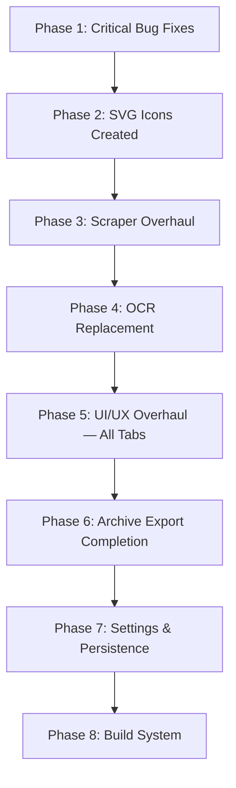

# Epic Brief — SC Dossier Full Overhaul

## Summary

SC Dossier is a PyQt6 desktop companion app for Star Citizen players. It runs as a compact always-on-top overlay toolbar snapped to the screen edge. One button expands to the full main window; the other enters OCR screen-capture mode to extract a player name and auto-search their RSI dossier. The main window has five tabs: Search, Dossier, Organization, Archive, and Settings. The visual identity is the **Aegis Liquid Interface** — deep-space glassmorphism with neon blue accents, tech-bracket corner ornaments, and Sora/Inter/JetBrains Mono typography (all font TTFs are confirmed present in `src/assets/fonts/`).

The codebase has ~30 Python source files with a sound layered architecture (`core → services → ui → app`). However, the app is **not functional in its current state**: critical layout bugs prevent scraped data from ever appearing on screen, signal wiring is broken so manual searches don't route correctly, the icon asset directory is empty (no SVGs exist yet despite the code referencing them), the scraper CSS selectors are likely stale against the live RSI website, and the OCR engine (EasyOCR) is heavyweight and re-instantiated per call. The UI tabs are structurally incomplete — missing GlassCard wrapping, broken layouts, missing controls, and missing features throughout.

This Epic covers the **complete overhaul** of the entire application: fixing every crash and bug, creating all missing SVG icons using the rich SC community icon library already present in the project, overhauling every tab's UI/UX to the Aegis spec, rewriting the scraper against the live RSI HTML structure, replacing the OCR engine with a lightweight local alternative, completing the archive export system, and delivering a working build system for Windows and Linux.

## Context & Problem

### Who Is Affected

The sole user and developer is the project owner — a Star Citizen player who wants a polished, functional companion tool for looking up players and orgs during gameplay without alt-tabbing to a browser.

### Where in the Product

Every layer of the product is affected:

| Layer | Problem |
| --- | --- |
| **Core bugs** | `detail_container` never added to layout in DossierTab and OrgTab — scraped data never appears |
| **Signal wiring** | `search_player_requested` not connected in controller — manual searches silently fail |
| **Icons** | `src/assets/icons/` is empty — all buttons show Unicode text fallbacks |
| **Fonts** | All 11 TTFs confirmed present ✅ — font registration code is correct ✅ |
| **Scraper** | CSS selectors written without live verification — likely broken against current RSI HTML |
| **OCR** | EasyOCR re-instantiated per call (slow); heavyweight model for a task that only needs short alphanumeric string extraction |
| **DossierTab** | No GlassCard wrapping, broken FlowLayout (badges don't wrap), no image refresh, no empty state |
| **OrgTab** | No GlassCard wrapping, no name→SID resolution, no candidate picker, no empty state |
| **ArchiveTab** | Missing two-pane layout, missing filter/sort, missing collapsible pane, export ZIP missing HTML/TXT/CSV |
| **SettingsTab** | OCR engine save uses `==` instead of assignment (never saves), missing 5+ settings sections |
| **SearchTab** | No player/org mode toggle, emits wrong signal |
| **Build system** | No PyInstaller spec, no packaging scripts |

### The Current Pain

The app cannot complete a single end-to-end user action successfully. A player search fires the wrong signal, the scraper may return no data, and even if it did, the detail view is never added to the layout so nothing would appear. The UI looks unpolished (Unicode fallback icons, no GlassCard sections in most tabs). The archive export is incomplete. Settings don't save correctly. The app is structurally sound but functionally broken at every user-facing touchpoint.

## Execution Order

Work proceeds in this sequence — each phase unblocks the next:

## Scope — What Gets Built

### Phase 1 — Critical Bug Fixes

- `DossierTab`: add `detail_container` to `content_layout`
- `OrgTab`: add `detail_container` to `content_layout`
- `MainWindow`: call `self.set_drag_widget(self.title_bar)` — title bar drag wiring
- `SettingsTab`: fix OCR engine save (`==` → assignment)
- `controller.py`: connect `search_player_requested` and `search_org_requested` signals
- `search_tab.py`: emit correct signals; add player/org mode toggle
- `main.py`: remove `main_window.show()` at startup (toolbar-only default)
- `status_bar.py`: fix `objectName("class")` → `"StatusText"`

### Phase 2 — SVG Icons

- Create all required SVG icons using the SC community icon library already in the project
- Wire SVGs into: toolbar buttons, title bar buttons, nav sidebar tabs (replacing Unicode chars), tray icon
- Use SC brand icons (`brand-icons/`, `manufact-names/`) as decorative elements in Dossier and Org tabs
- Use SC HUD PNGs (`ships/`) for badge/status display where appropriate

### Phase 3 — Scraper Overhaul

- Fetch live RSI pages for `PINKgeekPDX` and `THEKVLT`
- Analyze actual current HTML structure
- Rewrite all CSS selectors in `scraper_player.py` and `scraper_org.py`
- Add retry logic (3 attempts, exponential backoff)
- Add graceful fallback — partial data displays rather than crashing
- Handle: 404, private profiles, hidden orgs, missing optional fields

### Phase 4 — OCR Replacement

- Replace EasyOCR with `rapidocr-onnxruntime` (lightweight, local, no large model download)
- Only extracting short alphanumeric RSI handles (`[A-Za-z0-9_-]`, 4–20 chars)
- Lazy initialization — load engine only when capture button is clicked
- Keep existing `OCRWorker` QThread pattern; swap the engine underneath

### Phase 5 — UI/UX Overhaul (All Tabs)

- **DossierTab**: GlassCard sections, real WrapLayout for badges, image refresh on download, empty state, SC brand icon decorations
- **OrgTab**: GlassCard sections, name→SID resolution, candidate picker dialog, empty state, manufacturer logo display
- **ArchiveTab**: Two-pane QSplitter (list + detail), filter input, sort dropdown, collapsible list pane, GlassCard detail view
- **SettingsTab**: All 8 sections in GlassCard containers, all missing controls added, all auto-save
- **SearchTab**: Player/org mode toggle with visual distinction, correct signal emission
- **NavSidebar**: SVG icons replacing Unicode, stronger active state glow, animation on tab switch
- **MainWindow**: Geometry persistence, last-tab persistence, no maximize

### Phase 6 — Archive Export Completion

ZIP contains all five: `profile.json` + all images (`avatar.png`, badges, org logos) + `profile.txt` (plain text summary) + `profile.html` (Aegis-themed, inline base64 images, self-contained) + `profile.csv`

### Phase 7 — Settings & Persistence

- Window geometry saved/restored on hide/show
- Toolbar snap position saved/restored
- Last-active tab saved/restored
- Force-save settings on app shutdown
- Tray icon double-click → show main window or bring to front

### Phase 8 — Build System

- `SCDossier.spec` — PyInstaller onedir spec with all assets bundled
- `build/linux/debian/build_deb.sh` — Debian/Ubuntu packaging
- `build/linux/arch/PKGBUILD` — Arch packaging
- `scripts/tools/scraper_test.py` — already exists; verify it works
- `scripts/tools/ocr_test.py` — new OCR validation tool

## What Is Explicitly Out of Scope

- No maximize button or maximize capability
- No external API keys or third-party data services
- No `pystray` (tray handled by `QSystemTrayIcon`)
- No `pytesseract` (using `rapidocr-onnxruntime` instead)
- No mobile or web targets — Windows 10/11 and Linux only
- No production deployment, credentials management, or cloud infrastructure

## Success Criteria

App starts showing only the toolbar (not the main window)Toolbar expand button shows main window; hide button returns to toolbarPlayer search (manual type + Enter) completes and displays full dossier in DossierTabOCR capture (region select → extract → search) completes end-to-endOrg search (by name or SID) completes and displays full org in OrgTabArchive tab shows two-pane layout with filter, sort, and detail viewArchive export generates complete ZIP with all five file typesSettings tab has all controls and all auto-save correctlyAll SVG icons display (no Unicode text fallbacks anywhere)All fonts load correctly (Sora, Inter, JetBrains Mono — no system fallbacks)Tray icon works with full context menuWindow geometry and last-active tab persist across sessionsNo crashes on any action; no console errors during normal operationPyInstaller build produces a working Windows executable