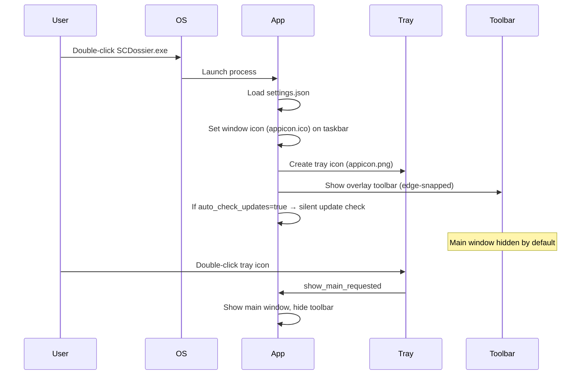
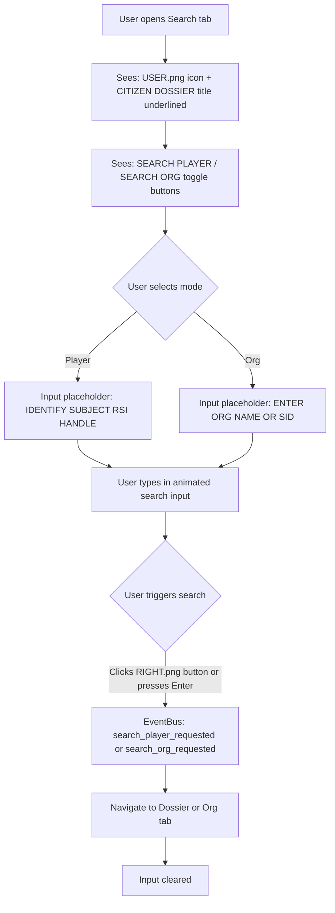
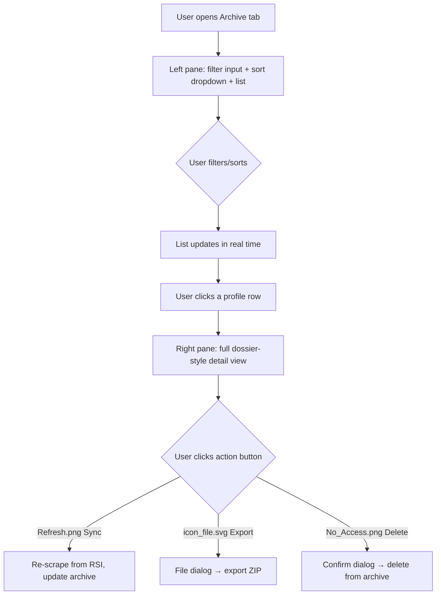
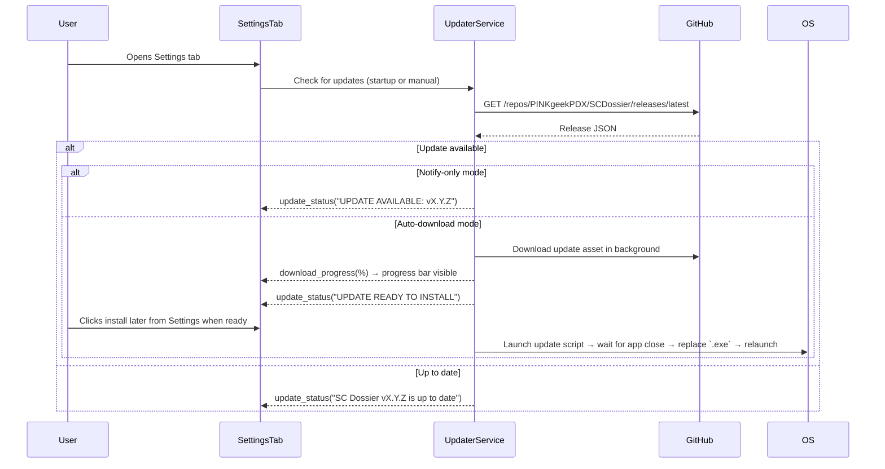

# Core Flows — SC Dossier UI Polish & Feature Completion

## Overview

This document defines all user-facing interaction flows across every surface of SC Dossier. These flows are the source of truth for what the UI must do — not how it does it technically.

## Flow 1: Application Launch

**Default launch behavior:** In both development run and packaged `.exe` runtime, the app launches to the overlay toolbar by default, with the main window hidden until the user explicitly opens it.

## Flow 2: Title Bar Interactions

The title bar is always visible when the main window is open.

| Element | State | Behavior |
| --- | --- | --- |
| App icon (far left) | Always | 24×24 `appicon.png`, no interaction |
| "SCD: Star Citizen Dossier" label | Always | Animated color pulse (blue sine wave) |
| Pin button | Unpinned | Shows `Unlock.png`; tooltip: "Pin window — keep on top of all other windows" |
| Pin button | Pinned | Shows `Lock.png`; tooltip: "Unpin window — allow other windows to overlap" |
| Pin button | Clicked | Toggles `WindowStaysOnTopHint`; disables Hide button while pinned |
| Hide button | Enabled | Shows `Return.png`; tooltip: "Minimize to toolbar — hides main window and shows the overlay toolbar" |
| Hide button | Clicked | Hides main window, shows overlay toolbar |
| Hide button | Disabled (pinned) | Grayed out; tooltip: "Unpin the window first before hiding" |
| Title bar drag area | Any | Drag to reposition the frameless window |

**Title bar gradient:** Left edge = `#040C1A` (dark blue), right edge = `#23282D` (grey), horizontal linear gradient.

## Flow 3: Nav Sidebar Navigation

| Nav Item | Icon Asset | Tooltip |
| --- | --- | --- |
| Search | `icons/misc/icon_search.svg` | "Search for Star Citizen players and organizations" |
| Dossier | `icons/Icons/FOIP.png` | "View the active citizen profile dossier" |
| Organization | `icons/Icons/SHLD.png` | "View organization details" |
| Archive | `icons/Icons/JOURNAL.png` | "Browse and manage archived citizen profiles" |
| Settings | `icons/misc/icon_settings.svg` | "Configure application preferences" |
| GitHub button (bottom) | `icons/Icons/!.png` | "Visit PINKgeekPDX on GitHub — opens in your browser" |

**Active state:** Left accent bar (3px, primary blue) + background highlight.
**Hover state:** Horizontal gradient highlight from left.
**GitHub button:** Calls `webbrowser.open("https://github.com/pinkgeekpdx")` — no crash, no navigation within app.

## Flow 4: Search Tab

**Search tab content rules:**

- Remove any stale "Aegis Liquid Interface RSI Network Access" text if present
- Title: `USER.png` (48×48) + spacing + "CITIZEN DOSSIER" label (underlined, larger, glow effect)
- Mode toggle buttons: `StyledToggleButton` — active = filled blue gradient, inactive = ghost outline, hover = subtle glow
- Search input: `AnimatedSearchInput` — border paint animation on focus, color change on hover, cursor visible when typing
- Initiate button: icon-only `RIGHT.png`, same hover/press effects as all action buttons
- Hint row: `info.png` (16×16) + "Enter player name or RSI dossier URL to find information"

## Flow 5: Dossier Tab

**Action bar (top):**

- `SearchInput` (styled, consistent with other tabs) — tooltip: "Enter an RSI handle to look up a citizen profile"
- Search button: icon-only `icon_search.svg` — tooltip: "Search for this RSI handle"
- Archive button: icon-only `icon_save.svg` — enabled only when a profile is loaded; tooltip: "Save this profile to your local archive"

**Content area:** Unchanged — GlassCard layout for identity, profile data, bio, badges, orgs.

## Flow 6: Org Tab

**Action bar (top):**

- `SearchInput` (styled, consistent) — tooltip: "Enter an organization name or SID to look up"
- Search button: icon-only `icon_search.svg` — tooltip: "Search for this organization"

**Content area:** Unchanged — GlassCard layout for org identity, data grid, focus, description.

## Flow 7: Archive Tab

**Left pane controls:**

- Filter input: `StyledFilterInput` — compact (h=32), hover/focus border animation; tooltip: "Type to filter archived profiles by name or handle"
- Sort dropdown: `StyledComboBox` — compact (h=28); tooltip: "Sort the archive list"
- Archive list: `StyledArchiveList` — each row shows avatar + moniker + handle + date; hover highlight
- Sync button: icon-only `Refresh.png`; tooltip: "Re-sync this profile with the latest RSI data"
- Export button: icon-only `icon_file.svg`; tooltip: "Export this profile as a self-contained archive file"
- Delete button: icon-only `No_Access.png`; tooltip: "Permanently delete this archived profile"

## Flow 8: Image Preview Popout

- User clicks an avatar or badge image anywhere in the app
- A larger frameless overlay-style preview pops out from the position of the clicked image
- The preview uses a thin 2–3px border and remains visually minimal, like an overlay frame rather than a standard OS window
- Clicking anywhere on the popout or anywhere else on screen dismisses and cleans up the preview
- The preview must work in both development run and packaged `.exe` runtime

## Flow 9: Settings Tab

### Section: General

| Control | Type | Tooltip |
| --- | --- | --- |
| Minimize to tray on close | Checkbox | "When you close the window, the app stays running in the system tray instead of quitting" |
| Pin window on startup | Checkbox | "Automatically keep the window on top of all other windows when the app starts" |
| Show tray notifications | Checkbox | "Display system tray notification bubbles for events like profile syncs and updates" |

### Section: Appearance

| Control | Type | Tooltip |
| --- | --- | --- |
| Font scale (80–150%) | Slider | "Scale all UI text size — 100% is default" |
| Accent color override | Text input | "Override the default blue accent with a hex color (e.g. #FF6600). Leave blank for default." |
| Toolbar opacity (30–100%) | Slider | "Control how transparent the overlay toolbar appears" |

### Section: Scraper

| Control | Type | Tooltip |
| --- | --- | --- |
| Request delay (0–10000ms) | SpinBox | "Pause between HTTP requests to RSI to avoid rate limiting" |
| Timeout (5–120s) | SpinBox | "Maximum wait time for a scraper request before giving up" |
| Proxy URL | Text input | "Optional HTTP proxy for scraper requests (e.g. [http://proxy:8080](http://proxy:8080))" |
| User agent | Text input | "Custom browser identity string sent with scraper requests" |

### Section: OCR

| Control | Type | Tooltip |
| --- | --- | --- |
| Engine | Dropdown | "OCR text recognition engine used for screen captures" |
| Confidence threshold (10–99%) | Slider | "Minimum confidence required to accept OCR-detected text" |
| Thread count (1–8) | SpinBox | "CPU threads dedicated to OCR processing" |

### Section: Sync & Cache

| Control | Type | Tooltip |
| --- | --- | --- |
| Sync interval (1–168h) | SpinBox | "How often archived profiles are automatically re-synced with RSI" |
| Auto-sync on archive load | Checkbox | "Re-sync a profile automatically when you open it in the archive viewer" |
| Cache max age (1–365 days) | SpinBox | "Maximum age for temporary cached data before automatic cleanup" |
| Auto-clear expired cache | Checkbox | "Automatically delete temporary cache files older than the max age" |
| Download concurrency (1–10) | SpinBox | "Number of simultaneous image downloads" |

### Section: Update Behavior

| Control | Type | Tooltip |
| --- | --- | --- |
| Auto-check for updates | Checkbox | "Check GitHub for a newer version when the app launches" |
| Auto-download updates | Checkbox | "Download newly detected updates automatically in the background" |
| Check for updates now | Action | "Manually check GitHub for a newer SC Dossier release" |
| Install downloaded update | Action | "Install an already-downloaded update later from Settings when you are ready to close and relaunch the app" |
| Update status | Read-only status text | "Shows whether the app is up to date, an update is available, or an update is ready to install" |
| Download progress | Progress bar | "Shows background update download progress when an update is being downloaded" |

### Section: Archive & Export Preferences

| Control | Type | Tooltip |
| --- | --- | --- |
| Default export destination | Path field | "Choose the default folder used when exporting archived profiles" |
| Remember last export folder | Checkbox | "Reuse the last export folder you selected the next time you export" |
| Default archive sort | Choice | "Choose how archived profiles are sorted when the Archive tab opens" |

### Section: Diagnostics & Logs

| Control | Type | Tooltip |
| --- | --- | --- |
| Open logs folder | Action | "Open the folder that contains SC Dossier log files" |
| Logging detail level | Choice | "Control whether the app writes normal or debug-level detail to its logs" |
| Include debug details in diagnostics | Checkbox | "Include additional troubleshooting detail in user-visible diagnostics and status messages" |
| Copy recent diagnostic summary | Action | "Copy a recent troubleshooting summary to the clipboard for sharing or support" |

### Section: Data Paths

Read-only display of: Config dir, Logs dir, Temp cache dir, Archived profiles dir.

### Section: About & Updates

**About pane content (bottom of Settings):**

- App name + version (from `APP_VERSION` constant)
- Framework: PyQt6
- Developer: PINKgeekPDX (clickable GitHub link)
- License: MIT License — Open Source
- Disclaimer: Not affiliated with Cloud Imperium Games / CIG

## Flow 10: Overlay Toolbar

| Button | Icon | Tooltip |
| --- | --- | --- |
| Show main window | `ships/default/MobiGlas.png` | "Open SC Dossier main window" |
| OCR capture | `ships/default/Target_Lock.png` | "Select a screen region for OCR text recognition" |

- Toolbar snaps to nearest screen edge on drag release
- Position and edge saved to `settings.json` on snap
- Opacity controlled by Settings → Appearance → Toolbar Opacity

## Flow 11: System Tray

- Tray icon: `appicon.png` (passed from `main.py`)
- Tooltip: "SC Dossier — Right-click for options"
- Double-click: show main window
- Right-click menu: Show Toolbar | Open Dossier | Quick Capture | Settings | — | Quit

## Tooltip Standard

Every interactive element in the app must have a `setToolTip()` call with a plain-English description of what it does. Tooltips must:

- Be written in sentence case
- Describe the action or value, not just repeat the label
- Be present on: all buttons, all checkboxes, all sliders, all text inputs, all dropdown menus, all status indicators