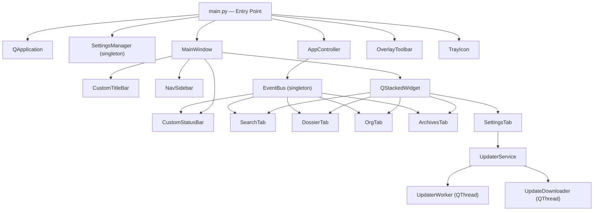

# Tech Plan — SC Dossier UI Polish & Feature Completion

## Architecture Overview

SC Dossier is a single-process PyQt6 desktop application. All UI runs on the main Qt thread. Background work (scraping, OCR, image downloads, update checks) runs on `QThread` workers and communicates back via Qt signals. The existing architecture is sound — this Epic makes no structural changes. All work is additive polish and wiring corrections. Acceptance must hold in both the development run and the packaged `.exe` runtime.



## Component-by-Component Technical Decisions

### 1. App Icon & Tray Icon (`main.py`, `main_window.py`)

**Current state:** `main.py` already sets `app.setWindowIcon(QIcon(appicon.ico))` and passes `app_icon` (from `appicon.png`) to `TrayIcon`. `MainWindow.__init__` also calls `self.setWindowIcon()`.

**Required action:** Verify the `.ico` path resolution is correct relative to the frozen PyInstaller bundle. The path uses `os.path.dirname(os.path.abspath(__file__))` which works in dev but may need `sys._MEIPASS` fallback in the bundled `.exe`. Add a helper in file:src/core/paths.py or file:src/app/constants.py that resolves asset paths correctly in both dev and frozen contexts.

**Decision:** Add `get_asset_path(relative: str) -> str` utility that checks `sys._MEIPASS` first, then falls back to the source tree. Use this everywhere icon paths are resolved.

### 2. Title Bar (file:src/ui/widgets/title_bar.py)

**Current state:** Fully implemented — gradient, animated label, icon, pin/hide buttons with correct icons.

**Required action:**

- Verify `_PROJECT_ROOT` path resolution works in frozen context (same `get_asset_path` fix above)
- Confirm "System Nominal" text is not rendered anywhere — it is not in the current source, so this is a non-issue unless it comes from a cached `.pyc` or old build
- No structural changes needed

### 3. Status Bar (file:src/ui/widgets/status_bar.py)

**Current state:** Ping/uptime labels already removed. Only dot + status text present.

**Required action:** None — already correct. Verify at runtime.

### 4. Nav Sidebar (file:src/ui/widgets/nav_sidebar.py)

**Current state:** All 5 tab icons wired to correct paths. GitHub button at bottom uses `!.png` and calls `webbrowser.open`.

**Required action:**

- Verify icon paths resolve correctly in frozen context (same `get_asset_path` fix)
- Confirm `webbrowser.open` does not crash — it should not, but test on Windows with default browser

### 4A. Overlay Toolbar & System Tray (file:src/ui/toolbar/overlay_toolbar.py, file:src/ui/tray/tray_icon.py, file:src/main.py)

**Current state:** The toolbar and tray are already present and largely wired, but the runtime behavior across launch, tray interaction, and toolbar persistence is not fully captured in the current tickets.

**Required action:**

- Preserve the toolbar-first launch behavior: create the tray icon, show the overlay toolbar, and keep the main window hidden by default in both development and packaged runtime
- Verify tray tooltip text, double-click behavior, and right-click menu actions (Show Toolbar, Open Dossier, Quick Capture, Settings, Quit)
- Verify toolbar edge snapping on drag release and persistence of toolbar position/edge to `settings.json`
- Verify toolbar opacity is applied from Settings and restored on relaunch

### 5. Search Tab (file:src/ui/tabs/search_tab.py)

**Current state:** `AnimatedSearchInput`, `StyledToggleButton`, `StyledActionButton` with `RIGHT.png`, USER.png title, info hint row — all implemented.

**Required action:**

- Scan for any remaining "Aegis Liquid Interface RSI Network Access" string — remove if found
- Verify `AnimatedSearchInput` cursor rendering doesn't conflict with Qt's native cursor (the custom `paintEvent` overrides native rendering; ensure `QLineEdit` text is still editable and cursor position is tracked correctly)
- Ensure `StyledActionButton` default state uses a visible background (currently `QColor(P.PRIMARY)` which may be too opaque — adjust to match hover/press style family)

### 6. Dossier Tab (file:src/ui/tabs/dossier_tab.py)

**Current state:** Icon-only search/archive buttons using `set_button_icon()`. `SearchInput` styled.

**Required action:**

- Apply the same `AnimatedSearchInput` focus/hover border effects to the `SearchInput` in the action bar (or replace with `AnimatedSearchInput` directly)
- Ensure `archive_btn` tooltip updates correctly when enabled/disabled

### 7. Org Tab (file:src/ui/tabs/org_tab.py)

**Current state:** Icon-only search button. `SearchInput` styled.

**Required action:** Same as Dossier tab — apply animated border effects to the search input for consistency.

### 8. Archive Tab (file:src/ui/tabs/archives_tab.py)

**Current state:** `StyledFilterInput`, `StyledComboBox`, `StyledArchiveList`, `StyledArchiveButton` — all implemented with hover effects and correct icons.

**Required action:**

- Verify `StyledComboBox.showPopup()` works correctly — the custom `paintEvent` overrides native rendering but `showPopup` still calls `super()`, which should work
- Ensure `No_Access.png` path is correct — the code uses `Icons/No_Access.png` (underscore) which exists; the `ships/default/No Access.png` (space) is a different file. The archive tab correctly uses the `Icons/` version.

### 9. Image Preview (file:src/ui/widgets/image_preview.py)

**Current state:** Uses a frameless modal dialog sized around the image and closes on click.

**Decision:** Replace the current preview with a larger **frameless overlay-style popout** that animates outward from the clicked image position. The preview should use a thin 2–3px border, behave like an overlay frame rather than a normal OS window, and dismiss itself when the user clicks either on the popout or anywhere else on screen.

### 10. Settings Tab (file:src/ui/tabs/settings_tab.py)

**Current state:** All sections present and wired. `UpdaterService` initialized in `_init_updater()`.

**Required action:**

- Fix `_init_updater()` — it calls `self.auto_check_cb.isChecked()` before `_load_values()` has run (since `_init_updater()` is called at end of `_build_ui()` but `_load_values()` is called after). Reorder: call `_load_values()` before `_init_updater()` in `__init__`.
- Keep the current settings footprint, but make the layout more compact, polished, and easier to understand.
- Add update controls for auto-check, auto-download, manual check-now, install-later, update status text, and download progress UI.
- Add settings for archive/export preferences and end-user diagnostics/logging controls.
- The added archive/export preferences are: default export destination, remember last export folder used, and default archive sort order.
- The added diagnostics/logging controls are: open logs folder, log verbosity selector (normal vs debug), toggle extra debug detail in user-visible diagnostics, and copy recent diagnostic summary.
- Add `auto_check_updates` and `auto_download_updates` to `_connect_signals()` — already present, verify they correctly write to `SettingsManager`.
- The Settings tab must use stable public updater methods/signals for check, download, staged-install readiness, and install-later behavior rather than reaching into updater private state.

### 11. Updater Service (file:src/services/updater_service.py)

**Current state:** `UpdaterWorker` checks GitHub API, `UpdateDownloader` downloads the asset, `_install_windows` writes a `.bat` script and launches it.

**Required action:**

- Support explicit user-facing `auto_check_updates` and `auto_download_updates` settings.
- When `auto_check_updates` is enabled, perform the startup background check; when disabled, do not check until the user clicks the manual check action in Settings.
- When `auto_download_updates` is enabled, download the update in the background, keep it staged locally, and let the user install it later from Settings rather than prompting immediately.
- The `.bat` script waits for `SCDossier.exe` by name — this is correct for a PyInstaller-bundled app.
- Add error handling for the case where the downloaded file is a `.zip` (not `.exe`) — extract the `.exe` from the zip before replacing.
- Store the selected asset URL and staged-download state on `UpdaterService` via a stable, non-private result path rather than reaching into worker internals.

### 12. Asset Path Resolution (Cross-cutting)

**Problem:** All icon paths use `os.path.dirname(__file__)` chains which work in development but break in PyInstaller frozen bundles where `__file__` points inside `sys._MEIPASS`.

**Solution:** Add to file:src/core/paths.py or a new file:src/core/asset_utils.py:

```python
# get_asset_path(relative_path: str) -> str
# Resolves asset paths for both dev and frozen (PyInstaller) contexts
```

All icon path constants in `title_bar.py`, `nav_sidebar.py`, `overlay_toolbar.py`, `search_tab.py`, `dossier_tab.py`, `org_tab.py`, `archives_tab.py` should use this utility.

### 13. Tooltip Completeness Audit

Every widget that currently lacks a `setToolTip()` call must have one added. Priority order:

1. All `QPushButton` instances (title bar, nav, toolbar, all tabs)
2. All `QCheckBox` instances (settings tab)
3. All `QSlider` instances (settings tab)
4. All `QSpinBox` instances (settings tab)
5. All `QLineEdit` / `SearchInput` instances
6. All `QComboBox` instances
7. Status bar dot indicator

## File Change Summary

| File | Change Type |
| --- | --- |
| file:src/core/paths.py or new `asset_utils.py` | Add `get_asset_path()` utility |
| file:src/ui/widgets/title_bar.py | Use `get_asset_path()`; verify no regressions |
| file:src/ui/widgets/nav_sidebar.py | Use `get_asset_path()`; verify GitHub button |
| file:src/ui/tray/tray_icon.py | Verify tray tooltip, double-click behavior, and context menu actions |
| file:src/ui/toolbar/overlay_toolbar.py | Use `get_asset_path()`; verify snap, persistence, and opacity wiring |
| file:src/ui/widgets/image_preview.py | Replace modal preview with overlay-style popout from clicked image position |
| file:src/ui/tabs/search_tab.py | Remove stale text if present; fix button default state |
| file:src/ui/tabs/dossier_tab.py | Apply animated border to search input |
| file:src/ui/tabs/org_tab.py | Apply animated border to search input |
| file:src/ui/tabs/archives_tab.py | Verify icon paths; verify combo popup |
| file:src/ui/tabs/settings_tab.py | Fix init order; verify updater wiring |
| file:src/services/updater_service.py | Fix asset URL storage; add zip extraction |
| file:src/main.py | Use `get_asset_path()` for icon resolution |

## Non-Goals

- No new scraper selectors or RSI data fields
- No OCR engine changes
- No new packaging pipeline work or installer redesign; only runtime fixes needed so the existing packaged `.exe` correctly reflects already-in-scope behavior
- No new database or persistence layer