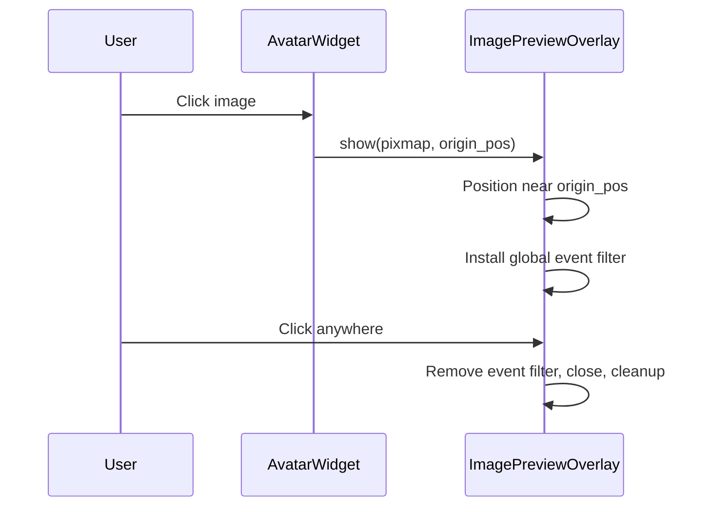

# T5: Image Preview — Frameless Overlay Popout

## Purpose

Replace the current `ImagePreviewDialog` with a frameless overlay-style popout that animates out from the position of the clicked image, uses a thin 2–3px border, and dismisses on any click anywhere on screen.

## Scope

**In:**

- file:src/ui/widgets/image_preview.py — full replacement of current implementation
- The popout must:
  - Be frameless (no OS window chrome)
  - Have a 2–3px accent-colored border
  - Pop out from the screen position of the clicked image widget (not centered on screen)
  - Scale the image to fill the popout at a large but reasonable size
  - Dismiss on click anywhere on the popout or anywhere else on screen (global mouse press event filter or `Qt.WindowType.Popup` flag)
  - Work in both dev and packaged runtime

**Out:**

- No changes to how callers invoke the preview (same call site API)
- No maximize/resize support (per user decision)

## Acceptance Criteria

- Clicking an avatar or badge image opens the frameless overlay popout near the clicked widget's screen position
- The popout has a visible 2–3px border in the app's primary accent color
- Clicking anywhere on the popout or anywhere else on screen closes and cleans up the popout
- No OS window chrome is visible
- Works in both dev and packaged runtime

