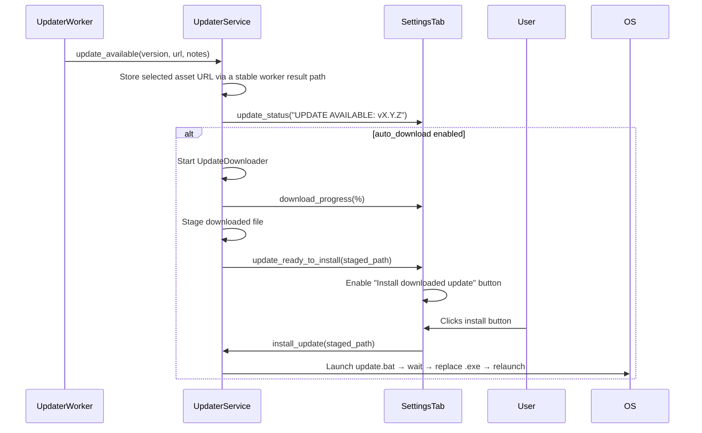

# T7: Updater Service Hardening — Staged Install, Asset URL Fix, ZIP Extraction

## Purpose

Fix the three known issues in file:src/services/updater_service.py: the fragile `_asset_url` retrieval from worker internals, the missing staged-install behavior (currently installs immediately on download complete), and the missing ZIP extraction step when the downloaded asset is a `.zip`.

## Scope

**In:**

- file:src/services/updater_service.py
- Store the selected asset URL on `UpdaterService` via a stable, non-private worker result path rather than reaching into `self._worker._asset_url`
- Change `_on_download_complete` to **stage** the downloaded file locally (persist path to settings or a known temp location) instead of calling `install_update()` immediately
- Emit a new signal (e.g. `update_ready_to_install`) so the Settings tab can enable the "Install downloaded update" button
- Add ZIP extraction: if the downloaded file ends in `.zip`, extract the `.exe` from it before replacing the current executable
- The `.bat` script wait-loop and self-replace logic is correct — no changes needed there

**Out:**

- Settings tab UI wiring (T6)
- No changes to the GitHub release source or repository selection behavior

## Acceptance Criteria

- `UpdaterService` stores the selected asset URL without reaching into worker private state
- After a background download completes, the app does **not** immediately install; it emits `update_ready_to_install` and stages the path
- The "Install downloaded update" button in Settings triggers `install_update(staged_path)` only when the user clicks it
- If the downloaded asset is a `.zip`, the `.exe` is extracted from it before the replace step
- In development mode (non-frozen), `install_update()` emits a clear "Cannot auto-update in development mode" status and does not crash

