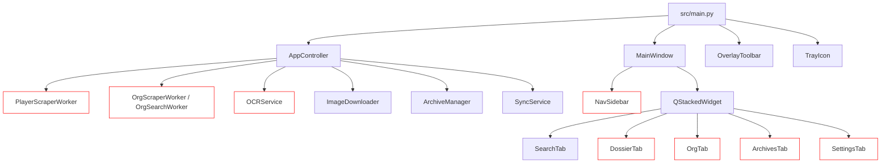
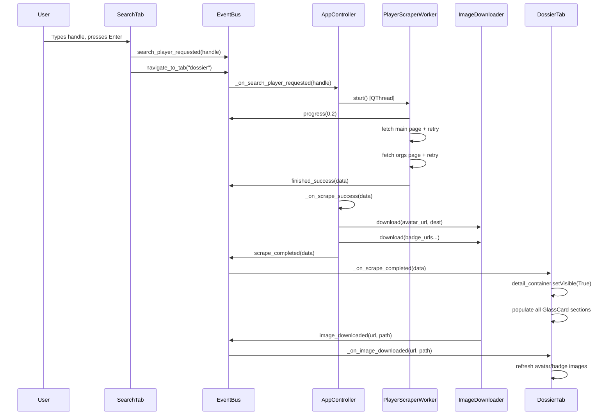

# Tech Plan — SC Dossier Full Overhaul

## Architectural Approach

### Guiding Constraints

The architecture is **already correct and must not be restructured**. The layered `core → services → ui → app` dependency graph is sound. The `EventBus` singleton pattern is the right communication mechanism. `QThread` for scrapers, `QThreadPool`/`QRunnable` for image downloads, and `QTimer` debounce for settings are all correct choices. The work is **surgical repair and completion**, not redesign.

### Key Architectural Decisions

| Decision | Choice | Rationale |
| --- | --- | --- |
| **OCR engine** | Replace `easyocr` with `rapidocr-onnxruntime` | EasyOCR re-instantiates a ~100MB model per call (confirmed in `ocr_service.py:38`). RapidOCR uses ONNX Runtime — lightweight, no model download, lazy-loadable as a module-level singleton. We're only extracting `[A-Za-z0-9_-]` handles, 4–20 chars. |
| **OCR singleton** | Module-level `_reader` variable in `ocr_service.py` | The `OCRWorker` currently creates `easyocr.Reader` inside `run()` every call. The fix: initialize once at module level (lazy, on first use), reuse across all `OCRWorker` instances. |
| **Scraper selectors** | Live-fetch + rewrite, keep `requests`+`BeautifulSoup`+`lxml` | The scraper architecture is correct. Only the CSS selectors in `scraper_player.py` and `scraper_org.py` need rewriting against the live RSI HTML. No library change needed. |
| **Scraper resilience** | Retry decorator with exponential backoff inside `run()` | Add 3-attempt retry with 1s/2s/4s delays for `requests.get` calls. Emit partial data on partial success rather than failing entirely. |
| **Icon system** | SVG files in `src/assets/icons/` loaded via `QIcon(path)` | The `ToolbarButton._load_icon()` pattern in `overlay_toolbar.py` is already correct — it checks `os.path.exists()` and falls back to text. The same pattern must be applied to `NavItem` (currently hardcodes Unicode chars). SVGs must be created at the exact paths the code already references. |
| **NavSidebar icons** | `QSvgRenderer` or `QIcon` loaded per `NavItem` | `NavItem.paintEvent` currently draws a Unicode char via `QFont("Segoe UI Symbol", 18)`. Replace with `QIcon(svg_path).pixmap(24, 24)` drawn via `painter.drawPixmap()`. |
| **DossierTab/OrgTab layout bug** | Add `detail_container` to `content_layout` | Confirmed in source: `self.detail_container` is built with `_build_detail()` but never added to `self.content_layout`. One line fix per tab: `self.content_layout.addWidget(self.detail_container)`. |
| **ArchivesTab detail bug** | Same pattern — `detail_content` never added to `detail_layout` | Confirmed: `self.detail_content` is built but never added to `self.detail_layout`. |
| **Settings OCR save bug** | Fix lambda on line 261 of `settings_tab.py` | `lambda: self.sm.ocr_engine == (...)` uses `==` (comparison). Must be `setattr(self.sm, 'ocr_engine', ...)` matching the pattern used for all other settings on lines 256–270. |
| **MainWindow drag** | Call `self.set_drag_widget(self.title_bar)` in `MainWindow.__init__` | `BaseWindow.set_drag_widget()` exists and is correct. `MainWindow` never calls it. One line fix. |
| **Build system** | PyInstaller `onedir` with `--add-data` for `src/assets/` | All assets (fonts, icons) are in `src/assets/`. PyInstaller spec must include them. `os.path.dirname(__file__)` references in the code are compatible with PyInstaller's `sys._MEIPASS`. |
| **requirements.txt** | Replace `easyocr` with `rapidocr-onnxruntime` | `easyocr>=1.7.1` → `rapidocr-onnxruntime>=1.3.0`. All other deps stay. |

## Data Model

The existing `profile.json` schema is the single source of truth and is already well-defined. No new entities are needed. The changes are additive field additions and schema clarifications only.

### PlayerProfile Dict (existing + additions)

```
handle          str       RSI handle (canonical from page)
moniker         str       Display name
page_url        str       Source URL
scraped_at      str       ISO 8601 UTC timestamp
enlisted        str       Enlist date string
location        str|None  Location string
fluency         list[str] Language list
bio             str|None  Biography text
avatar_url      str       Remote avatar URL
avatar_local    str       Local file path (set after download)
badges          list[BadgeDict]
orgs            list[OrgRefDict]
archived_at     str|None  Set when promoted to archive
synced_at       str|None  Set on each sync
```

### BadgeDict (existing)

```
name            str
image_url       str
image_local     str
```

### OrgRefDict (existing — on player profile)

```
name            str
sid             str
rank            str
logo_url        str
logo_local      str
is_main         bool
visibility      None      (RSI doesn't expose this)
member_count    None      (RSI doesn't expose this on citizen page)
```

### OrgProfile Dict (existing + additions)

```
sid             str
name            str
page_url        str
scraped_at      str
logo_url        str
logo_local      str
banner_url      str|None
banner_local    str|None
archetype       str|None
language        str|None
commitment      str|None
recruiting      bool
roleplay        bool
member_count    int
description     str|None
focus_primary   str|None
focus_secondary str|None
```

### No Schema Changes Required

The `profile.json` structure is already complete. The archive export (`_generate_txt`, `_generate_csv`, `_generate_html`) in `archive_manager.py` already reads all fields correctly. The HTML export uses relative image paths — this must be updated to inline base64 for true self-containment.

## Component Architecture

### Component Map — What Changes Where



*Red border = component requires changes*

### 1. OCRService — `src/services/ocr_service.py`

**Current:** `OCRWorker.run()` calls `easyocr.Reader(['en'], gpu=False)` every invocation — slow, heavyweight.

**New design:**

- Replace `easyocr` import with `rapidocr_onnxruntime`
- Module-level `_rapid_ocr_instance: RapidOCR | None = None` — initialized lazily on first `OCRWorker.run()` call, reused thereafter
- `OCRWorker.run()` accesses the module singleton, calls `reader(image_path)`, receives `(boxes, txts, scores)` tuple
- Post-processing: filter by confidence threshold, concatenate candidates, apply `re.sub(r'[^A-Za-z0-9_-]', '', text)` — same logic as current
- `OCRService.process_image()` interface unchanged — `EventBus.capture_completed` and `EventBus.capture_failed` still emitted
- `SettingsManager.ocr_engine` value updated from `"easyocr"` to `"rapidocr"` in `DEFAULT_SETTINGS` and `OCREngine` enum in `constants.py`

### 2. PlayerScraper — `src/services/scraper_player.py`

**Current:** CSS selectors written speculatively. Key suspects:

- `.profile-content .profile .info` — likely wrong
- `.dossier .accreditation` — likely wrong
- `.orgs-content .org` — likely wrong

**New design:**

- Live-fetch `https://robertsspaceindustries.com/en/citizens/PINKgeekPDX` and analyze actual HTML
- Rewrite all selectors to match confirmed live structure
- Add `_fetch_with_retry(url, headers, max_attempts=3)` helper inside `run()` — wraps `requests.get` with exponential backoff (1s, 2s, 4s delays)
- On partial success (main profile scraped, orgs page fails): emit `finished_success` with whatever data was collected rather than `finished_error`
- Handle `Redacted` org visibility gracefully (already partially handled)
- Handle 403/Cloudflare: emit `finished_error` with user-friendly message `"RSI WEBSITE BLOCKED REQUEST — TRY AGAIN LATER"`

### 3. OrgScraper — `src/services/scraper_org.py`

**Current:** `OrgSearchWorker` uses `.org-grid .org-cell` selectors on the listing page. `OrgScraperWorker` uses `.org-info h1`, `.org-logo img`, `.focus .item` etc.

**New design:**

- Same retry pattern as PlayerScraper
- Live-fetch `https://robertsspaceindustries.com/en/orgs/THEKVLT` and `https://robertsspaceindustries.com/en/community/orgs/listing?search=THEKVLT` to verify selectors
- Rewrite all selectors to match confirmed live structure
- `OrgSearchWorker` must handle empty results (no candidates) gracefully — already emits `candidates_found([])` which `AppController._on_org_candidates_found` handles correctly

### 4. NavSidebar — `src/ui/widgets/nav_sidebar.py`

**Current:** `NAV_ITEMS` uses Unicode chars `("⌕", "◉", "⬡", "⊞", "⚙")`. `NavItem.paintEvent` draws them via `QFont("Segoe UI Symbol", 18)`.

**New design:**

- `NAV_ITEMS` updated to include SVG icon paths alongside labels:
    ```python
    (TabId.SEARCH.value, "icons/misc/search.svg", "SEARCH"),
    (TabId.DOSSIER.value, "icons/misc/person.svg", "DOSSIER"),
    ...
    ```
- `NavItem.__init__` receives `icon_path: str` instead of `icon: str`
- `NavItem.paintEvent` loads `QIcon(resolved_path).pixmap(22, 22)` and draws via `painter.drawPixmap(icon_rect, pixmap)`
- Fallback: if SVG path doesn't exist, fall back to current Unicode char behavior
- Active state: stronger glow — increase active background alpha from `26` to `40`, increase left accent bar from `2px` to `3px`

### 5. DossierTab — `src/ui/tabs/dossier_tab.py`

**Critical fix:** After `_build_detail()` is called, add:

```python
self.content_layout.addWidget(self.detail_container)
```

This is the single line that makes scraped data appear.

**Additional changes:**

- `_on_image_downloaded`: currently calls `_on_scrape_completed(self._current_data)` which re-populates everything including clearing and re-adding badges/orgs — this is correct but expensive. Optimize: only refresh avatar and badge images by checking if the downloaded URL matches a known local path in `_current_data`.
- SC brand icon decorations: add a small RSI logo SVG (`brand-icons/sc-icon-brand-rsi.svg`) to the identity card header area as a watermark/decoration
- `WrapLayout.resizeEvent` already calls `_do_layout()` — this is correct. No changes needed.

### 6. OrgTab — `src/ui/tabs/org_tab.py`

**Critical fix:** After `_build_detail()` is called, add:

```python
self.content_layout.addWidget(self.detail_container)
```

**Additional changes:**

- Manufacturer logo decoration: when org data is loaded, attempt to match `data["name"]` against known manufacturer names (RSI, Anvil, Drake, etc.) and display the corresponding SVG from `manufact-names/` as a decorative element in the identity card

### 7. ArchivesTab — `src/ui/tabs/archives_tab.py`

**Critical fix:** After `_build_detail_content()` is called, add:

```python
self.detail_layout.addWidget(self.detail_content)
```

**Additional changes:**

- `_apply_filter` currently calls `_apply_sort(filtered)` but `_apply_sort` ignores its argument and re-filters from scratch — this double-filter is harmless but redundant. Consolidate into a single `_refresh_display()` method.
- `detail_badges_layout` is a `QHBoxLayout` — badges don't wrap. Replace with the same `WrapLayout` from `dossier_tab.py` (or extract `WrapLayout` to `src/ui/widgets/wrap_layout.py` and import in both tabs).

### 8. SettingsTab — `src/ui/settings_tab.py`

**Bug fix:** Line 261:

```python
# BROKEN:
lambda: self.sm.ocr_engine == ("easyocr" if ... else "tesseract")
# FIXED:
lambda: setattr(self.sm, 'ocr_engine', self.ocr_combo.currentData())
```

**Additional changes:**

- Update `ocr_combo` items to reflect new engine: `"RapidOCR"` / `"rapidocr"` instead of `"EasyOCR"` / `"easyocr"`
- `_load_values()` updated to match new engine value

### 9. MainWindow — `src/app/main_window.py`

**Bug fix:** In `_build_ui()`, after `self.title_bar = CustomTitleBar(self)`, add:

```python
self.set_drag_widget(self.title_bar)
```

**Additional changes:**

- `_toggle_maximize` method exists but is never called and must remain unused (no maximize per spec)
- Geometry restore: already implemented in `main.py` via `main_window.setGeometry(geom)` ✅
- Geometry save: already implemented in `closeEvent` ✅

### 10. SVG Icon Creation

All SVG files must be created at exact paths the code already references:

| Path | Source Material | Usage |
| --- | --- | --- |
| `src/assets/icons/expand.svg` | Create: grid/expand HUD icon | Toolbar expand button |
| `src/assets/icons/capture.svg` | Create: crosshair/reticle icon | Toolbar capture button |
| `src/assets/icons/pin.svg` | Create: pin/thumbtack icon | Title bar pin button |
| `src/assets/icons/hide.svg` | Create: collapse/chevron icon | Title bar hide button |
| `src/assets/icons/tray.svg` | Create: SC Dossier app icon | System tray |
| `src/assets/icons/misc/search.svg` | Already exists ✅ | NavSidebar Search tab |
| `src/assets/icons/misc/person.svg` | Already exists ✅ | NavSidebar Dossier tab |
| `src/assets/icons/misc/groups.svg` | Already exists ✅ | NavSidebar Org tab |
| `src/assets/icons/misc/archive.svg` | Already exists ✅ | NavSidebar Archive tab |
| `src/assets/icons/misc/settings.svg` | Already exists ✅ | NavSidebar Settings tab |

The 5 root-level SVGs (`expand`, `capture`, `pin`, `hide`, `tray`) must be created. They should be monochrome `#00AAFF` on transparent background, 24×24 viewBox, aerospace/HUD aesthetic matching the Aegis design system.

### 11. Archive Export — HTML Self-Containment

**Current:** `_generate_html()` in `archive_manager.py` uses relative image paths (`src="avatar.png"`). When the ZIP is extracted, images work. But the spec requires inline base64 for true self-containment.

**New design:**

- `_generate_html(data)` reads each local image file, base64-encodes it, and embeds as `data:image/png;base64,...` in `` tags
- Falls back to empty `src=""` if local file doesn't exist
- All other HTML structure and Aegis styling remains identical

### 12. Build System — `SCDossier.spec`

**New files:**

- `SCDossier.spec` — PyInstaller `onedir` spec at project root
  - `datas`: `[('src/assets/fonts', 'src/assets/fonts'), ('src/assets/icons', 'src/assets/icons')]`
  - `hiddenimports`: `['rapidocr_onnxruntime', 'lxml', 'bs4']`
  - `icon`: `src/assets/icons/tray.ico` (Windows)
- `build/linux/debian/build_deb.sh` — wraps PyInstaller output in `.deb` structure
- `build/linux/arch/PKGBUILD` — Arch packaging
- `scripts/tools/ocr_test.py` — validates RapidOCR on a test image
- `build.py` (already exists at root) — verify it invokes PyInstaller correctly

### Signal Flow — End-to-End (Verified Against Code)



### Wireframes — UI Layout Reference

```wireframe

<html>
<head>
<style>
* { margin: 0; padding: 0; box-sizing: border-box; }
body { background: #050B0F; color: #D2E5F6; font-family: monospace; font-size: 12px; display: flex; height: 100vh; }
.sidebar { width: 64px; background: rgba(10,21,29,0.9); border-right: 1px solid rgba(0,170,255,0.1); display: flex; flex-direction: column; align-items: center; padding: 8px 0; gap: 4px; }
.nav-item { width: 52px; height: 52px; display: flex; align-items: center; justify-content: center; border-radius: 4px; cursor: pointer; color: #A8B3BD; font-size: 18px; }
.nav-item.active { background: rgba(0,170,255,0.10); border-left: 3px solid #00AAFF; color: #00AAFF; }
.nav-item:hover { background: rgba(79,142,255,0.12); color: #D2E5F6; }
.sidebar-spacer { flex: 1; }
.toggle-btn { width: 52px; height: 40px; display: flex; align-items: center; justify-content: center; color: #A8B3BD; border-top: 1px solid rgba(0,170,255,0.1); cursor: pointer; }
.main { flex: 1; display: flex; flex-direction: column; }
.titlebar { height: 48px; background: rgba(10,29,41,0.6); border-bottom: 1px solid rgba(0,170,255,0.15); display: flex; align-items: center; padding: 0 16px; gap: 8px; }
.titlebar-title { flex: 1; font-size: 11px; letter-spacing: 0.15em; color: #A8B3BD; }
.titlebar-btn { width: 32px; height: 32px; border: 1px solid rgba(0,170,255,0.2); border-radius: 4px; display: flex; align-items: center; justify-content: center; color: #A8B3BD; cursor: pointer; font-size: 14px; }
.content { flex: 1; overflow: hidden; display: flex; flex-direction: column; }
.action-bar { height: 64px; background: rgba(10,29,41,0.4); border-bottom: 1px solid rgba(0,170,255,0.08); display: flex; align-items: center; padding: 0 24px; gap: 12px; }
.search-input { flex: 1; height: 44px; background: rgba(5,11,15,0.85); border: 1px solid rgba(62,72,81,1); border-radius: 4px; padding: 0 12px; color: #D2E5F6; font-family: monospace; font-size: 12px; }
.btn-primary { height: 44px; width: 100px; background: #00AAFF; color: #003351; border: none; border-radius: 4px; font-size: 11px; letter-spacing: 0.1em; cursor: pointer; font-weight: bold; }
.btn-ghost { height: 44px; width: 100px; background: transparent; color: #D2E5F6; border: 1px solid rgba(0,170,255,0.3); border-radius: 4px; font-size: 11px; letter-spacing: 0.1em; cursor: pointer; }
.scroll-area { flex: 1; overflow-y: auto; padding: 24px; display: flex; flex-direction: column; gap: 20px; }
.glass-card { background: rgba(10,29,41,0.40); border: 1px solid rgba(0,170,255,0.15); border-radius: 4px; position: relative; }
.card-header { height: 32px; background: rgba(0,170,255,0.07); border-bottom: 1px solid rgba(0,170,255,0.10); display: flex; align-items: center; padding: 0 16px; font-size: 10px; letter-spacing: 0.15em; color: #A8B3BD; }
.card-body { padding: 16px; }
.identity-row { display: flex; gap: 20px; align-items: center; }
.avatar-box { width: 120px; height: 120px; background: rgba(15,33,46,1); border: 1px solid rgba(0,170,255,0.3); border-radius: 4px; display: flex; align-items: center; justify-content: center; color: #A8B3BD; font-size: 32px; flex-shrink: 0; }
.name-block { display: flex; flex-direction: column; gap: 4px; }
.moniker { font-size: 22px; color: #D2E5F6; letter-spacing: 0.05em; }
.handle { font-size: 14px; color: #00AAFF; }
.data-grid { display: grid; grid-template-columns: repeat(3, 1fr); gap: 12px; }
.data-field { background: rgba(0,0,0,0.2); border-radius: 4px; padding: 12px; }
.field-label { font-size: 10px; letter-spacing: 0.15em; color: #A8B3BD; margin-bottom: 4px; }
.field-value { font-size: 13px; color: #D2E5F6; }
.statusbar { height: 28px; background: rgba(5,11,15,0.9); border-top: 1px solid rgba(0,170,255,0.08); display: flex; align-items: center; padding: 0 16px; gap: 16px; font-size: 10px; letter-spacing: 0.1em; color: #A8B3BD; }
.status-dot { width: 6px; height: 6px; border-radius: 50%; background: #00AAFF; }
</style>
</head>
<body>
<div class="sidebar">
  <div class="nav-item" data-element-id="nav-search">⌕</div>
  <div class="nav-item active" data-element-id="nav-dossier">◉</div>
  <div class="nav-item" data-element-id="nav-org">⬡</div>
  <div class="nav-item" data-element-id="nav-archive">⊞</div>
  <div class="nav-item" data-element-id="nav-settings">⚙</div>
  <div class="sidebar-spacer"></div>
  <div class="toggle-btn" data-element-id="sidebar-toggle">▸</div>
</div>
<div class="main">
  <div class="titlebar">
    <div class="titlebar-title">SC DOSSIER — AEGIS LIQUID INTERFACE</div>
    <div class="titlebar-btn" data-element-id="pin-btn">📌</div>
    <div class="titlebar-btn" data-element-id="hide-btn">◂</div>
  </div>
  <div class="content">
    <div class="action-bar">
      <input class="search-input" placeholder="ENTER RSI HANDLE..." data-element-id="dossier-search" />
      <button class="btn-primary" data-element-id="search-btn">SEARCH</button>
      <button class="btn-ghost" data-element-id="archive-btn">ARCHIVE</button>
    </div>
    <div class="scroll-area">
      <div class="glass-card">
        <div class="card-header">IDENTITY CORE</div>
        <div class="card-body">
          <div class="identity-row">
            <div class="avatar-box">◎</div>
            <div class="name-block">
              <div class="moniker">PINKgeekPDX</div>
              <div class="handle">@PINKgeekPDX</div>
            </div>
          </div>
        </div>
      </div>
      <div class="glass-card">
        <div class="card-header">PROFILE DATA</div>
        <div class="card-body">
          <div class="data-grid">
            <div class="data-field"><div class="field-label">ENLISTED</div><div class="field-value">2013-10-11</div></div>
            <div class="data-field"><div class="field-label">LOCATION</div><div class="field-value">Oregon, USA</div></div>
            <div class="data-field"><div class="field-label">FLUENCY</div><div class="field-value">English</div></div>
          </div>
        </div>
      </div>
      <div class="glass-card">
        <div class="card-header">BIOGRAPHY</div>
        <div class="card-body" style="color:#BEC7D3;line-height:1.6;">Player biography text appears here...</div>
      </div>
      <div class="glass-card">
        <div class="card-header">ACCREDITATIONS & CLEARANCES</div>
        <div class="card-body" style="display:flex;gap:8px;flex-wrap:wrap;">
          <div style="background:rgba(0,170,255,0.05);border:1px solid rgba(0,170,255,0.2);border-radius:18px;padding:4px 12px;font-size:11px;">Backer</div>
          <div style="background:rgba(0,170,255,0.05);border:1px solid rgba(0,170,255,0.2);border-radius:18px;padding:4px 12px;font-size:11px;">Concierge</div>
        </div>
      </div>
      <div class="glass-card">
        <div class="card-header">AFFILIATED ORGANIZATIONS</div>
        <div class="card-body" style="display:flex;flex-direction:column;gap:12px;">
          <div style="background:rgba(10,29,41,0.4);border:1px solid rgba(0,170,255,0.15);border-radius:4px;padding:12px;display:flex;gap:16px;align-items:center;">
            <div style="width:52px;height:52px;background:rgba(15,33,46,1);border:1px solid rgba(0,170,255,0.2);border-radius:4px;display:flex;align-items:center;justify-content:center;color:#A8B3BD;">◎</div>
            <div><div style="color:#D2E5F6;font-size:14px;font-weight:bold;">The Kvlt</div><div style="color:#00AAFF;font-size:12px;">THEKVLT • Commander (MAIN)</div></div>
          </div>
        </div>
      </div>
    </div>
  </div>
  <div class="statusbar">
    <div class="status-dot"></div>
    <span>DATA RETRIEVED SUCCESSFULLY</span>
    <span style="margin-left:auto;">12:34:56</span>
  </div>
</div>
</body>
</html>
```

```wireframe

<html>
<head>
<style>
* { margin: 0; padding: 0; box-sizing: border-box; }
body { background: #050B0F; color: #D2E5F6; font-family: monospace; font-size: 12px; display: flex; height: 100vh; }
.sidebar { width: 64px; background: rgba(10,21,29,0.9); border-right: 1px solid rgba(0,170,255,0.1); display: flex; flex-direction: column; align-items: center; padding: 8px 0; gap: 4px; }
.nav-item { width: 52px; height: 52px; display: flex; align-items: center; justify-content: center; border-radius: 4px; cursor: pointer; color: #A8B3BD; font-size: 18px; }
.nav-item.active { background: rgba(0,170,255,0.10); border-left: 3px solid #00AAFF; color: #00AAFF; }
.sidebar-spacer { flex: 1; }
.toggle-btn { width: 52px; height: 40px; display: flex; align-items: center; justify-content: center; color: #A8B3BD; border-top: 1px solid rgba(0,170,255,0.1); cursor: pointer; }
.main { flex: 1; display: flex; flex-direction: column; }
.titlebar { height: 48px; background: rgba(10,29,41,0.6); border-bottom: 1px solid rgba(0,170,255,0.15); display: flex; align-items: center; padding: 0 16px; gap: 8px; }
.titlebar-title { flex: 1; font-size: 11px; letter-spacing: 0.15em; color: #A8B3BD; }
.titlebar-btn { width: 32px; height: 32px; border: 1px solid rgba(0,170,255,0.2); border-radius: 4px; display: flex; align-items: center; justify-content: center; color: #A8B3BD; cursor: pointer; }
.content { flex: 1; display: flex; flex-direction: column; overflow: hidden; }
.header-bar { height: 56px; background: rgba(10,29,41,0.4); border-bottom: 1px solid rgba(0,170,255,0.08); display: flex; align-items: center; padding: 0 24px; }
.header-title { font-size: 11px; letter-spacing: 0.15em; color: #00AAFF; }
.splitter { flex: 1; display: flex; overflow: hidden; }
.left-pane { width: 260px; min-width: 200px; border-right: 1px solid rgba(0,170,255,0.08); display: flex; flex-direction: column; padding: 12px; gap: 8px; }
.filter-input { height: 36px; background: rgba(5,11,15,0.85); border: 1px solid rgba(62,72,81,1); border-radius: 4px; padding: 0 10px; color: #D2E5F6; font-family: monospace; font-size: 11px; }
.sort-row { display: flex; align-items: center; gap: 8px; }
.sort-label { font-size: 10px; letter-spacing: 0.1em; color: #A8B3BD; width: 60px; }
.sort-select { flex: 1; height: 32px; background: rgba(5,11,15,0.85); border: 1px solid rgba(62,72,81,1); border-radius: 4px; color: #D2E5F6; font-family: monospace; font-size: 11px; }
.archive-list { flex: 1; overflow-y: auto; display: flex; flex-direction: column; gap: 4px; }
.archive-item { height: 56px; display: flex; align-items: center; gap: 12px; padding: 0 12px; border: 1px solid transparent; border-radius: 4px; cursor: pointer; }
.archive-item.selected { border-color: rgba(0,170,255,0.3); background: rgba(0,170,255,0.05); }
.archive-item:hover { border-color: rgba(0,170,255,0.15); background: rgba(0,170,255,0.03); }
.item-avatar { width: 40px; height: 40px; background: rgba(15,33,46,1); border: 1px solid rgba(0,170,255,0.2); border-radius: 4px; display: flex; align-items: center; justify-content: center; color: #A8B3BD; flex-shrink: 0; }
.item-info { display: flex; flex-direction: column; gap: 2px; }
.item-name { font-size: 13px; color: #D2E5F6; font-weight: bold; }
.item-meta { font-size: 10px; color: #A8B3BD; }
.action-btns { display: flex; gap: 8px; }
.btn-sm { flex: 1; height: 36px; border-radius: 4px; font-size: 10px; letter-spacing: 0.08em; cursor: pointer; }
.btn-ghost-sm { background: transparent; color: #D2E5F6; border: 1px solid rgba(0,170,255,0.3); }
.btn-danger-sm { background: transparent; color: #FF3B3B; border: 1px solid rgba(255,59,59,0.3); }
.right-pane { flex: 1; overflow-y: auto; padding: 24px; display: flex; flex-direction: column; gap: 20px; }
.glass-card { background: rgba(10,29,41,0.40); border: 1px solid rgba(0,170,255,0.15); border-radius: 4px; }
.card-header { height: 32px; background: rgba(0,170,255,0.07); border-bottom: 1px solid rgba(0,170,255,0.10); display: flex; align-items: center; padding: 0 16px; font-size: 10px; letter-spacing: 0.15em; color: #A8B3BD; }
.card-body { padding: 16px; }
.statusbar { height: 28px; background: rgba(5,11,15,0.9); border-top: 1px solid rgba(0,170,255,0.08); display: flex; align-items: center; padding: 0 16px; font-size: 10px; letter-spacing: 0.1em; color: #A8B3BD; }
</style>
</head>
<body>
<div class="sidebar">
  <div class="nav-item" data-element-id="nav-search">⌕</div>
  <div class="nav-item" data-element-id="nav-dossier">◉</div>
  <div class="nav-item" data-element-id="nav-org">⬡</div>
  <div class="nav-item active" data-element-id="nav-archive">⊞</div>
  <div class="nav-item" data-element-id="nav-settings">⚙</div>
  <div class="sidebar-spacer"></div>
  <div class="toggle-btn">▸</div>
</div>
<div class="main">
  <div class="titlebar">
    <div class="titlebar-title">SC DOSSIER — AEGIS LIQUID INTERFACE</div>
    <div class="titlebar-btn">📌</div>
    <div class="titlebar-btn">◂</div>
  </div>
  <div class="content">
    <div class="header-bar"><div class="header-title">ARCHIVED PROFILES</div></div>
    <div class="splitter">
      <div class="left-pane">
        <input class="filter-input" placeholder="FILTER ARCHIVES..." data-element-id="filter-input" />
        <div class="sort-row">
          <div class="sort-label">SORT BY</div>
          <select class="sort-select" data-element-id="sort-select">
            <option>Name A-Z</option>
            <option>Name Z-A</option>
            <option>Date Archived</option>
            <option>Last Synced</option>
          </select>
        </div>
        <div class="archive-list">
          <div class="archive-item selected" data-element-id="archive-item-0">
            <div class="item-avatar">◎</div>
            <div class="item-info">
              <div class="item-name">PINKgeekPDX</div>
              <div class="item-meta">@PINKgeekPDX  •  2026-05-15</div>
            </div>
          </div>
          <div class="archive-item" data-element-id="archive-item-1">
            <div class="item-avatar">◎</div>
            <div class="item-info">
              <div class="item-name">SomeCitizen</div>
              <div class="item-meta">@SomeCitizen  •  2026-05-10</div>
            </div>
          </div>
        </div>
        <div class="action-btns">
          <button class="btn-sm btn-ghost-sm" data-element-id="sync-btn">SYNC</button>
          <button class="btn-sm btn-ghost-sm" data-element-id="export-btn">EXPORT</button>
          <button class="btn-sm btn-danger-sm" data-element-id="delete-btn">DELETE</button>
        </div>
      </div>
      <div class="right-pane">
        <div class="glass-card">
          <div class="card-header">IDENTITY CORE</div>
          <div class="card-body" style="display:flex;gap:20px;align-items:center;">
            <div style="width:120px;height:120px;background:rgba(15,33,46,1);border:1px solid rgba(0,170,255,0.3);border-radius:4px;display:flex;align-items:center;justify-content:center;color:#A8B3BD;font-size:32px;flex-shrink:0;">◎</div>
            <div><div style="font-size:22px;color:#D2E5F6;">PINKgeekPDX</div><div style="font-size:14px;color:#00AAFF;">@PINKgeekPDX</div></div>
          </div>
        </div>
        <div class="glass-card">
          <div class="card-header">PROFILE DATA</div>
          <div class="card-body" style="display:grid;grid-template-columns:repeat(3,1fr);gap:12px;">
            <div style="background:rgba(0,0,0,0.2);border-radius:4px;padding:12px;"><div style="font-size:10px;letter-spacing:0.15em;color:#A8B3BD;">ENLISTED</div><div style="font-size:13px;color:#D2E5F6;margin-top:4px;">2013-10-11</div></div>
            <div style="background:rgba(0,0,0,0.2);border-radius:4px;padding:12px;"><div style="font-size:10px;letter-spacing:0.15em;color:#A8B3BD;">ARCHIVED</div><div style="font-size:13px;color:#D2E5F6;margin-top:4px;">2026-05-15</div></div>
            <div style="background:rgba(0,0,0,0.2);border-radius:4px;padding:12px;"><div style="font-size:10px;letter-spacing:0.15em;color:#A8B3BD;">LAST SYNCED</div><div style="font-size:13px;color:#D2E5F6;margin-top:4px;">2026-05-15</div></div>
          </div>
        </div>
      </div>
    </div>
  </div>
  <div class="statusbar">READY</div>
</div>
</body>
</html>
```