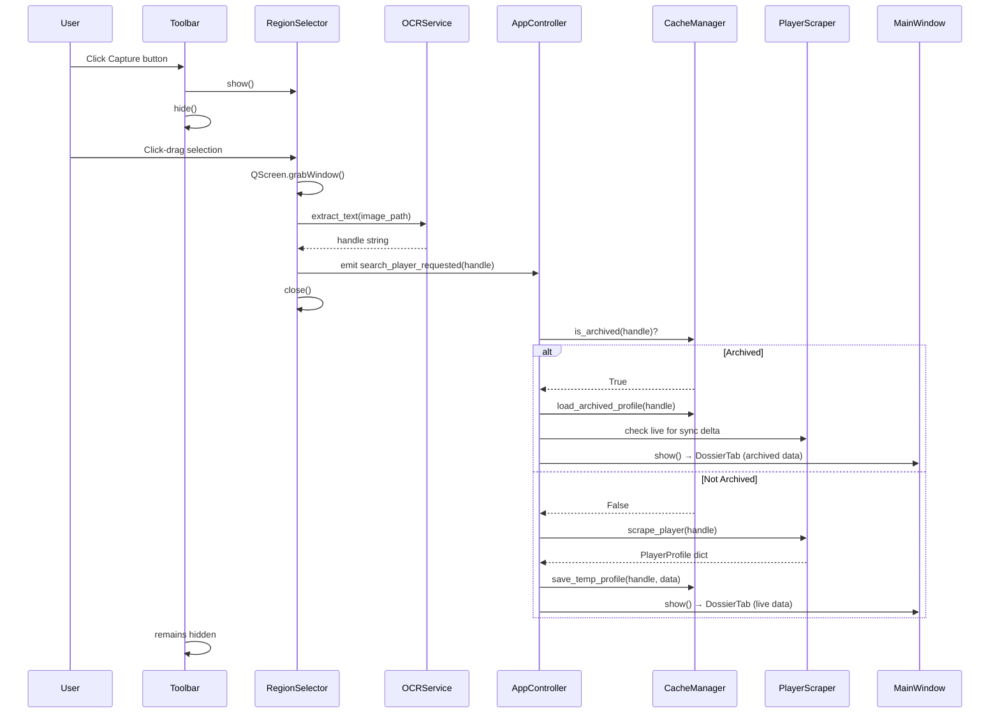

I have created the following plan after thorough exploration and analysis of the codebase. Follow the below plan verbatim. Trust the files and references. Do not re-verify what's written in the plan. Explore only when absolutely necessary. First implement all the proposed file changes and then I'll review all the changes together at the end.

## Observations

The workspace is a clean slate at `C:\Users\Administrator\Desktop\projects\SCDossier\` with only `ui-example-files/` containing a detailed **"Aegis Liquid Interface"** design spec (DESIGN.md) and a reference HTML file. The design system is a deep-space glassmorphism aesthetic using Sora, Inter, and JetBrains Mono fonts, a near-black `#050B0F` base, `#00AAFF` primary blue glows, and "tech bracket" corner ornaments. The RSI site exposes player data via both direct HTML scraping and the unofficial `starcitizen-api.com` API. Org search requires a two-step name→SID resolution via the RSI listing page. PyQt6 is the correct framework choice for always-on-top frameless windows, `QSystemTrayIcon`, `QRubberBand` capture, and cross-platform support.

## Approach

**PyQt6** is chosen over Tkinter/Pygame for its mature frameless window support, `QSystemTrayIcon`, `QRubberBand`, `QScreen.grabWindow`, and rich styling via `QSS`. The architecture is layered: a persistent `AppController` orchestrates the tray, toolbar, and main window; dedicated service classes handle scraping, OCR, caching, archiving, and settings. All UI components inherit from shared base widgets that implement the Aegis Liquid Interface theme. This keeps concerns cleanly separated and makes each layer independently testable.

---

## Project Structure

```
SCDossier/
├── src/
│   ├── main.py                          # Entry point
│   ├── app/
│   │   ├── __init__.py
│   │   ├── controller.py                # AppController — orchestrates all top-level state
│   │   └── constants.py                 # App-wide enums, string constants, path keys
│   ├── core/
│   │   ├── __init__.py
│   │   ├── paths.py                     # PathManager — resolves all OS-aware data paths
│   │   ├── settings.py                  # SettingsManager — load/save/watch settings.json
│   │   ├── logger.py                    # Logging setup (rotating file handler → Logs/)
│   │   └── events.py                    # Qt signals bus for cross-component communication
│   ├── services/
│   │   ├── __init__.py
│   │   ├── scraper_player.py            # PlayerScraper — RSI citizen page + org sub-page
│   │   ├── scraper_org.py               # OrgScraper — RSI org page + listing name→SID
│   │   ├── image_downloader.py          # ImageDownloader — async image fetch + disk cache
│   │   ├── ocr_service.py               # OCRService — EasyOCR/Tesseract text extraction
│   │   ├── cache_manager.py             # CacheManager — Temp & Archived profile I/O
│   │   ├── archive_manager.py           # ArchiveManager — archive CRUD, sync, export zip
│   │   └── sync_service.py              # SyncService — diff live vs archived, update logic
│   ├── ui/
│   │   ├── __init__.py
│   │   ├── theme/
│   │   │   ├── __init__.py
│   │   │   ├── palette.py               # Color constants from DESIGN.md
│   │   │   ├── fonts.py                 # Font registration (Sora, Inter, JetBrains Mono)
│   │   │   └── stylesheet.py            # Global QSS string builder
│   │   ├── widgets/
│   │   │   ├── __init__.py
│   │   │   ├── base_window.py           # BaseWindow — frameless, draggable, resizable
│   │   │   ├── title_bar.py             # CustomTitleBar — drag region, pin btn, hide btn
│   │   │   ├── status_bar.py            # CustomStatusBar — status, ping, uptime readout
│   │   │   ├── nav_sidebar.py           # NavSidebar — icon-rail left nav with tab switching
│   │   │   ├── glass_card.py            # GlassCard — mica panel with tech-bracket corners
│   │   │   ├── tech_label.py            # TechLabel — label-caps styled QLabel
│   │   │   ├── data_field.py            # DataField — label + JetBrains Mono value pair
│   │   │   ├── avatar_widget.py         # AvatarWidget — image display with bracket overlay
│   │   │   ├── badge_chip.py            # BadgeChip — badge image + name pill widget
│   │   │   ├── search_input.py          # SearchInput — styled QLineEdit with glow focus
│   │   │   ├── progress_overlay.py      # ProgressOverlay — scanning animation during fetch
│   │   │   └── confirm_dialog.py        # ConfirmDialog — styled modal for destructive actions
│   │   ├── toolbar/
│   │   │   ├── __init__.py
│   │   │   └── overlay_toolbar.py       # OverlayToolbar — frameless, always-on-top, snapping
│   │   ├── capture/
│   │   │   ├── __init__.py
│   │   │   └── region_selector.py       # RegionSelector — fullscreen overlay + QRubberBand
│   │   ├── main_window/
│   │   │   ├── __init__.py
│   │   │   ├── main_window.py           # MainWindow — BaseWindow with sidebar + tab content
│   │   │   └── tabs/
│   │   │       ├── __init__.py
│   │   │       ├── search_tab.py        # SearchTab — player/org mode selector + search box
│   │   │       ├── dossier_tab.py       # DossierTab — full player profile display
│   │   │       ├── org_tab.py           # OrgTab — org profile display
│   │   │       ├── archive_tab.py       # ArchiveTab — list pane + detail pane
│   │   │       └── settings_tab.py      # SettingsTab — all configurable options
│   │   └── tray/
│   │       ├── __init__.py
│   │       └── tray_icon.py             # TrayIcon — QSystemTrayIcon + context menu
│   └── assets/
│       ├── icons/
│       │   ├── expand.svg               # Toolbar expand button icon
│       │   ├── capture.svg              # Toolbar capture button icon
│       │   ├── pin.svg
│       │   ├── hide.svg
│       │   ├── tray.svg
│       │   └── ...                      # All other UI SVG icons
│       └── fonts/
│           ├── Sora-*.ttf
│           ├── Inter-*.ttf
│           └── JetBrainsMono-*.ttf
├── scripts/
│   ├── run_dev.py                       # Dev runner script
│   └── tools/
│       ├── scraper_test.py              # One-off scraper validation tool
│       └── ocr_test.py                  # One-off OCR accuracy test tool
├── build/
│   ├── windows/
│   │   └── build_windows.spec           # PyInstaller spec for Windows binary
│   └── linux/
│       ├── debian/
│       │   └── build_deb.sh
│       ├── arch/
│       │   └── build_arch.sh
│       └── mint_ubuntu/
│           └── build_deb_ubuntu.sh
├── built/
│   └── dist/
│       ├── windows/
│       └── linux/
├── docs/
│   ├── documentation/
│   │   └── README.md
│   └── work/
│       ├── todo/
│       ├── summaries/
│       └── reports/
├── logs/                                # Dev/tool script logs only
├── README.md
├── agent.md
├── requirements.txt
└── SCDossier.spec                       # Root PyInstaller project spec
```

---

## Phase 1 — Project Bootstrap & Core Infrastructure

### 1.1 — `requirements.txt`
Define all dependencies. Confirmed libraries to include:
- `PyQt6` — UI framework
- `requests` — HTTP for scraping (no API key needed; direct HTML fetch only)
- `beautifulsoup4` + `lxml` — HTML parsing (pure HTML scraping, no API)
- `Pillow` — image processing
- `easyocr` — local OCR (preferred over pytesseract for accuracy on game UI fonts; no external binary dependency)
- `pyinstaller` — packaging
- `pystray` is **not** needed — use `PyQt6.QtWidgets.QSystemTrayIcon` natively

### 1.2 — `src/core/paths.py` — `PathManager`
Implement a singleton that resolves all data paths in an OS-aware manner:
- **Windows:** `%USERPROFILE%\Documents\PINK\SCDossier\`
- **Linux:** `~/Documents/PINK/SCDossier/` (or `$XDG_DOCUMENTS_DIR/PINK/SCDossier/`)

Expose named properties for:
- `config_dir` → `Config/`
- `logs_dir` → `Logs/`
- `temp_cache_dir(player_name)` → `Cache/Temp/<player>/`
- `archived_dir(player_name)` → `Cache/Archived/<player>/`
- `settings_file` → `Config/settings.json`

All directories must be created on first access if they don't exist.

### 1.3 — `src/core/settings.py` — `SettingsManager`
- Load `settings.json` on startup; create with defaults if absent
- Expose typed getters/setters for all settings keys
- Auto-save on every value change (debounced with a short `QTimer` to batch rapid changes)
- Settings schema must include: toolbar position (`x`, `y`, `edge`), main window geometry (`x`, `y`, `w`, `h`), last active tab, pin state, OCR engine preference, scraper request delay, sync interval, theme overrides

### 1.4 — `src/core/logger.py`
- Configure Python `logging` with a `RotatingFileHandler` writing to `PathManager.logs_dir / app.log`
- Max 5MB per file, keep 3 backups
- Also emit to console in dev mode

### 1.5 — `src/core/events.py` — Signal Bus
Define a `QObject`-based singleton with `pyqtSignal` declarations for all cross-component events:
- `search_player_requested(handle: str)`
- `search_org_requested(query: str)`
- `profile_loaded(data: dict)`
- `org_loaded(data: dict)`
- `capture_completed(text: str)`
- `archive_updated()`
- `settings_changed(key: str, value)`
- `status_message(text: str, level: str)`

---

## Phase 2 — Theme & Base UI Widgets

### 2.1 — `src/ui/theme/palette.py`
Define all color constants from `DESIGN.md` as Python string constants (e.g., `SPACE_VOID = "#050B0F"`, `PRIMARY = "#93ccff"`, `PRIMARY_CONTAINER = "#00aaff"`, `GLASS_BORDER = "rgba(0,170,255,0.3)"`, etc.)

### 2.2 — `src/ui/theme/fonts.py`
Use `QFontDatabase.addApplicationFont()` to register all bundled `.ttf` files from `src/assets/fonts/`. Expose helper functions `font_sora(size, weight)`, `font_inter(size)`, `font_mono(size)`.

### 2.3 — `src/ui/theme/stylesheet.py`
Build the global QSS string that styles:
- `QWidget` base background
- `QPushButton` — primary (solid blue), ghost (bracketed border), icon-only variants
- `QLineEdit` — dark recessed with glow focus state
- `QScrollBar` — 6px thin, `rgba(0,170,255,0.2)` thumb
- `QListWidget` — hover gradient highlight
- `QLabel` variants by object name

Apply via `QApplication.setStyleSheet()` at startup.

### 2.4 — `src/ui/widgets/base_window.py` — `BaseWindow`
A `QWidget` subclass that:
- Sets `FramelessWindowHint | WindowStaysOnTopHint` (conditionally for toolbar; main window uses `FramelessWindowHint` only unless pinned)
- Sets `WA_TranslucentBackground` for glass effect
- Implements `mousePressEvent`, `mouseMoveEvent`, `mouseReleaseEvent` for drag-to-reposition
- Implements resize handles on all 8 edges/corners with min/max size constraints (no maximize)
- Paints the background with the `space-void` radial gradient from the design spec

### 2.5 — `src/ui/widgets/glass_card.py` — `GlassCard`
A `QFrame` subclass that:
- Paints `rgba(10,29,41,0.4)` background with `backdrop-filter` equivalent (use `QGraphicsBlurEffect` or paint a blurred background snapshot)
- Draws `1px rgba(0,170,255,0.15)` border
- Paints the four "tech bracket" corner ornaments (8×8px `#00aaff` L-shapes with glow) using `QPainter` in `paintEvent`

### 2.6 — `src/ui/widgets/title_bar.py` — `CustomTitleBar`
- Fixed height 48px, drag region for window repositioning
- Left: SVG app icon + `CITIZEN DOSSIER // SC-DOSSIER` in `label-caps` style
- Center: status indicators (connection, system time) in `label-caps`
- Right: **Pin button** (toggle topmost + lock collapse) and **Hide button** (collapse to toolbar)
- 1px bottom border in `rgba(0,170,255,0.15)`

### 2.7 — `src/ui/widgets/status_bar.py` — `CustomStatusBar`
- Fixed height 28px, `#020d14` background
- Left: animated pulse dot + `SYSTEM STATUS: NOMINAL` / error states
- Right: `PING`, `UPTIME`, connection icon — all in `label-caps` JetBrains Mono

### 2.8 — `src/ui/widgets/nav_sidebar.py` — `NavSidebar`
- Fixed width 64px icon-rail (expandable to 240px on hover/toggle)
- Nav items: Search (action), Dossier, Organization, Archive, Settings
- Active item: `bg-primary/10` + `border border-primary/20` + inner glow
- Hover: horizontal gradient highlight from `rgba(79,142,255,0.2)` to transparent
- Emit tab-switch signal on click

### 2.9 — Remaining shared widgets
- **`avatar_widget.py`**: `QLabel` with pixmap, tech-bracket overlay painted in `paintEvent`, placeholder icon when no image
- **`badge_chip.py`**: Horizontal layout with badge image (24×24) + badge name in `data-point` font, pill-shaped border
- **`data_field.py`**: Two-row widget — `label-caps` label on top, `data-point` value below, inside a `bg-black/20` rounded container
- **`search_input.py`**: `QLineEdit` with glow border on focus, scanning-line animation via `QPropertyAnimation` on a pseudo-element overlay
- **`progress_overlay.py`**: Semi-transparent overlay with animated scanning line and status text, shown during scrape operations
- **`confirm_dialog.py`**: Styled `QDialog` using `GlassCard` as container, themed buttons

---

## Phase 3 — Overlay Toolbar

### `src/ui/toolbar/overlay_toolbar.py` — `OverlayToolbar`

```
┌─────────────────────┐
│  [≡ expand]  [⊕ cap]│  ← 2 SVG icon buttons only
└─────────────────────┘
```

- Inherits `BaseWindow` with `FramelessWindowHint | WindowStaysOnTopHint | Tool`
- Orientation: auto-detects horizontal vs vertical based on which screen edge it is snapped to
- **Snap logic**: on `mouseReleaseEvent`, call `snap_to_nearest_edge()` which uses `QScreen.availableGeometry()` to find the closest of the 4 edges and snaps the toolbar flush to it; saves `(x, y, edge)` to `SettingsManager`
- **Restore on startup**: reads saved position from settings and moves to that position before `show()`
- **Button 1 — Expand**: emits `events.expand_main_window`; hides toolbar, shows `MainWindow`
- **Button 2 — Capture**: emits `events.start_capture`; hides toolbar, launches `RegionSelector`
- Both buttons use high-quality SVG icons loaded via `QIcon` from `src/assets/icons/`

---

## Phase 4 — Screen Capture & OCR

### 4.1 — `src/ui/capture/region_selector.py` — `RegionSelector`

Flow:
```
User clicks capture btn
        ↓
Toolbar hides
        ↓
RegionSelector shows (fullscreen transparent overlay, crosshair cursor)
        ↓
User click-drags → QRubberBand draws selection rect
        ↓
Mouse release → hide overlay → QScreen.grabWindow(0, x, y, w, h)
        ↓
Save temp PNG → pass to OCRService
        ↓
OCRService returns extracted string
        ↓
If empty/failed → show ConfirmDialog with error
If success → emit search_player_requested(handle)
```

- Use `QGuiApplication.primaryScreen().virtualGeometry()` to cover all monitors
- Set `WA_TranslucentBackground` + `setWindowOpacity(0.3)` for dimmed overlay
- Draw a dim rectangle over the entire screen except the selected region using `QPainter` in `paintEvent`
- Show pixel dimensions tooltip near cursor during drag
- `Escape` key cancels and restores toolbar

### 4.2 — `src/services/ocr_service.py` — `OCRService`

- Use **EasyOCR** (`easyocr.Reader(['en'])`) initialized once at startup in a background thread to avoid blocking UI
- `extract_text(image_path: str) -> str | None`: runs EasyOCR on the captured PNG
- Post-process: strip whitespace, filter to alphanumeric + underscore (RSI handles are `[A-Za-z0-9_-]`), take the longest valid token if multiple results
- If EasyOCR confidence < threshold (configurable in settings), return `None` to trigger error dialog
- Store the temp capture PNG in `PathManager.temp_cache_dir("_captures") / capture_<timestamp>.png`

---

## Phase 5 — Scraping Services

### 5.1 — `src/services/scraper_player.py` — `PlayerScraper`

**Pure HTML scraping — no API keys required.**

The scraper uses only direct HTML parsing of the RSI citizen dossier pages. No external API dependencies.

**`scrape_player(handle: str) -> dict`** method:
1. Fetch `https://robertsspaceindustries.com/en/citizens/{handle}` with `requests` + `BeautifulSoup`
2. Parse the page HTML to extract all visible fields:
   - **Moniker** (display name): extracted from page `<title>` tag (format: `Moniker | Handle - ...`)
   - **Handle**: extracted from page title or from visible "Handle name" label section
   - **Enlisted**: parsed from "Enlisted" label section
   - **Location**: parsed from "Location" label section (if public/visible)
   - **Bio**: parsed from "Bio" label section (if filled)
   - **Fluency**: parsed from "Fluency" label section (language list)
   - **Avatar image URL**: extracted from profile image element
   - **Badges**: parsed from "Accreditations & Clearances" section — each badge has an image and name
3. Fetch `https://robertsspaceindustries.com/en/citizens/{handle}/organizations` to extract all affiliated organizations:
   - For each org: name, SID, rank, logo URL, member count, visibility status
4. For each organization found, fetch `https://robertsspaceindustries.com/en/orgs/{sid}` to gather full org details (description, archetype, focus, language, commitment, recruiting status, roleplay status)
5. Pass all image URLs to `ImageDownloader` for async download into `temp_cache_dir(handle)/`
6. Return complete profile dict

**`PlayerProfile` schema:**
```
{
  "handle": str,
  "moniker": str,
  "display": str,
  "enlisted": str,
  "location": str | null,
  "bio": str | null,
  "fluency": [str],
  "avatar_url": str,
  "avatar_local": str,          ← local path after download
  "badges": [
    {"name": str, "image_url": str, "image_local": str}
  ],
  "organizations": [
    {
      "name": str, "sid": str, "rank": str,
      "logo_url": str, "logo_local": str,
      "description": str | null,
      "archetype": str | null,
      "focus_primary": str | null,
      "focus_secondary": str | null,
      "language": str | null,
      "commitment": str | null,
      "recruiting": bool,
      "roleplay": bool,
      "member_count": int | null,
      "visibility": str | null,
      "is_main": bool
    }
  ],
  "page_url": str,
  "scraped_at": str             ← ISO timestamp
}
```

### 5.2 — `src/services/scraper_org.py` — `OrgScraper`

**Pure HTML scraping — no API keys required.**

**Name → SID resolution strategy:**
1. User types a query (name or SID)
2. Scrape `https://robertsspaceindustries.com/en/community/orgs/listing?search={query}&sort=default` with BeautifulSoup
3. Parse the org listing page HTML to extract all matching org cards: extract `(name, SID)` pairs from each card
4. If exactly one match: use that SID directly
5. If multiple matches: return a list of candidates to the UI for user selection
6. If no matches: show error dialog
7. Once SID is confirmed, fetch `https://robertsspaceindustries.com/en/orgs/{sid}` to scrape full org details:
   - Name, SID, logo, banner image
   - Description, archetype, focus tags, language, commitment level
   - Recruiting status, roleplay status
   - Member count, member roster (paginated if needed)

**`OrgProfile` schema:**
```
{
  "name": str,
  "sid": str,
  "logo_url": str,
  "logo_local": str,
  "banner_url": str | null,
  "banner_local": str | null,
  "description": str | null,
  "archetype": str | null,
  "focus_primary": str | null,
  "focus_secondary": str | null,
  "language": str | null,
  "commitment": str | null,
  "recruiting": bool,
  "roleplay": bool,
  "member_count": int,
  "members_preview": [...],
  "page_url": str,
  "scraped_at": str
}
```

### 5.3 — `src/services/image_downloader.py` — `ImageDownloader`

- Uses `QThreadPool` + `QRunnable` workers for concurrent image downloads
- `download(url, dest_path)`: skip if file already exists and is non-zero size
- Emits progress signals back to UI via the events bus
- Handles HTTP errors gracefully, logs failures, uses placeholder on failure

---

## Phase 6 — Cache & Archive Management

### 6.1 — `src/services/cache_manager.py` — `CacheManager`

- `save_temp_profile(handle, profile_dict)`: writes `profile.json` to `Cache/Temp/<handle>/`
- `load_temp_profile(handle) -> dict | None`: reads from temp cache
- `clear_temp(handle)`: deletes temp dir for a handle
- `list_temp_profiles() -> [str]`: lists all handles in temp cache
- `is_archived(handle) -> bool`: checks if `Cache/Archived/<handle>/profile.json` exists

### 6.2 — `src/services/archive_manager.py` — `ArchiveManager`

- `archive_profile(handle)`: copies from `Temp/<handle>/` to `Archived/<handle>/`, updates `profile.json` with `archived_at` timestamp
- `load_archived_profile(handle) -> dict`
- `delete_archived_profile(handle)`: removes entire `Archived/<handle>/` directory
- `list_archived_profiles() -> [str]`: scans `Cache/Archived/` for all handle directories
- `export_profile_zip(handle, dest_path)`: builds a ZIP containing:
  - `profile.json` (all text data)
  - `avatar.png`, all badge images, org logo images
  - `profile.txt` (human-readable plain text summary)
  - `profile.html` (self-contained styled card using embedded base64 images, themed to match the app aesthetic)

### 6.3 — `src/services/sync_service.py` — `SyncService`

- `check_sync_needed(handle) -> bool`: compares `scraped_at` in archived profile against a configurable max-age from settings
- `sync_profile(handle)`: re-runs `PlayerScraper.scrape_player(handle)`, diffs against archived data, updates only changed fields and re-downloads changed images, updates `profile.json` with new `scraped_at`
- Emits `archive_updated` signal on completion

---

## Phase 7 — Main Window & Tabs

### 7.1 — `src/ui/main_window/main_window.py` — `MainWindow`

Layout:
```
┌──────────────────────────────────────────────────────┐
│  CustomTitleBar (drag, pin btn, hide btn)             │
├──────┬───────────────────────────────────────────────┤
│      │                                               │
│ Nav  │         Tab Content Area                      │
│ Side │         (stacked QStackedWidget)              │
│ bar  │                                               │
│      │                                               │
├──────┴───────────────────────────────────────────────┤
│  CustomStatusBar                                      │
└──────────────────────────────────────────────────────┘
```

- Inherits `BaseWindow`; `FramelessWindowHint` only (no `WindowStaysOnTopHint` unless pinned)
- Min size: `900×600`, no maximize
- `QStackedWidget` holds all tab content panels
- `NavSidebar` drives `QStackedWidget.setCurrentIndex()`
- Geometry and last-active tab persisted via `SettingsManager`
- **Pin button**: toggles `WindowStaysOnTopHint` flag + disables hide button while pinned
- **Hide button**: hides `MainWindow`, shows `OverlayToolbar`
- On first session open: show `SearchTab`; on subsequent shows: restore last tab

### 7.2 — `src/ui/main_window/tabs/search_tab.py` — `SearchTab`

```
┌─────────────────────────────────────┐
│  [ SEARCH PLAYER ]  [ SEARCH ORG ]  │  ← toggle buttons
│                                     │
│  ┌─────────────────────────────┐    │
│  │  Enter handle / org name... │    │  ← SearchInput
│  └─────────────────────────────┘    │
│  [ INITIATE SEARCH ]                │
└─────────────────────────────────────┘
```

- Two mode toggle buttons: **SEARCH PLAYER** / **SEARCH ORG**
- Selecting PLAYER mode: switches `MainWindow` to DossierTab but shows search UI within it
- Selecting ORG mode: switches to OrgTab but shows search UI within it
- On search initiation: show `ProgressOverlay`, run scraper in `QThread`, on completion hide overlay and show results

### 7.3 — `src/ui/main_window/tabs/dossier_tab.py` — `DossierTab`

Two states: **search mode** (search input + progress) and **display mode** (full profile).

Display mode layout (mirrors the reference HTML):
```
┌─────────────────────────────────────────────────────┐
│  ┌──────────────────────────┐  ┌───────────────────┐│
│  │ IDENTITY CORE            │  │ PRIMARY AFFILIATION││
│  │ [Avatar] [Handle]        │  │ [Org Logo]        ││
│  │          [Enlisted]      │  │ [Org Name]        ││
│  │          [Location]      │  │ [Org SID]         ││
│  │          [Fluency]       │  │ [Rank]            ││
│  │          [Bio]           │  │                   ││
│  └──────────────────────────┘  └───────────────────┘│
│  ┌─────────────────────────────────────────────────┐ │
│  │ ACCREDITATIONS & CLEARANCES                     │ │
│  │ [Badge] [Badge] [Badge] ...                     │ │
│  └─────────────────────────────────────────────────┘ │
│  ┌─────────────────────────────────────────────────┐ │
│  │ AFFILIATED ORGANIZATIONS (if multiple)          │ │
│  │ [Org card] [Org card] ...                       │ │
│  └─────────────────────────────────────────────────┘ │
│  [ ARCHIVE PROFILE ]  [ SYNC ]  [ EXPORT ]           │
└─────────────────────────────────────────────────────┘
```

All panels are `GlassCard` instances. All images use `AvatarWidget` / `BadgeChip`. All text fields use `DataField`. Only fields with actual scraped data are shown (no placeholder text for missing optional fields).

### 7.4 — `src/ui/main_window/tabs/org_tab.py` — `OrgTab`

Two states: search mode and display mode.

Display mode:
```
┌─────────────────────────────────────────────────────┐
│  ┌──────────────────────────────────────────────┐   │
│  │ ORG IDENTITY                                 │   │
│  │ [Logo] [Name] [SID] [Archetype]              │   │
│  │        [Focus] [Language] [Commitment]       │   │
│  │        [Recruiting] [Roleplay] [Members]     │   │
│  │        [Description]                         │   │
│  └──────────────────────────────────────────────┘   │
│  ┌──────────────────────────────────────────────┐   │
│  │ MEMBER ROSTER (preview, paginated)           │   │
│  │ [Avatar] Handle — Rank — Stars              │   │
│  └──────────────────────────────────────────────┘   │
└─────────────────────────────────────────────────────┘
```

### 7.5 — `src/ui/main_window/tabs/archive_tab.py` — `ArchiveTab`

Two-pane layout with collapsible list pane:

```
┌──────────────────┬──────────────────────────────────┐
│ [▶ collapse]     │                                  │
│ Filter: [____]   │   (DossierTab display mode        │
│ Sort: [▼]        │    reused here, read-only,        │
│                  │    populated from archived JSON)  │
│ ○ PINKgeekPDX    │                                  │
│ ○ SomePlayer     │                                  │
│ ○ AnotherOne     │                                  │
│                  │                                  │
│ [SYNC] [DELETE]  │                                  │
│ [EXPORT ZIP]     │                                  │
└──────────────────┴──────────────────────────────────┘
```

- List pane: `QListWidget` with custom item delegates for the glow-hover effect; filter `QLineEdit` + sort `QComboBox` (by name A-Z, Z-A, date archived, last synced)
- Collapse button: animates list pane width from ~220px to 0 using `QPropertyAnimation`
- Per-profile action buttons: **SYNC CHECK** (runs `SyncService.check_sync_needed` then optionally `sync_profile`), **DELETE** (shows `ConfirmDialog`), **EXPORT ZIP** (runs `ArchiveManager.export_profile_zip`, saves to Desktop)
- Detail pane: reuses the same `GlassCard` layout as `DossierTab` display mode, populated from `ArchiveManager.load_archived_profile()`

### 7.6 — `src/ui/main_window/tabs/settings_tab.py` — `SettingsTab`

Sections (each in a `GlassCard`):
- **Appearance**: theme accent color override, font size scale
- **Scraper**: request delay (ms), user-agent string, API key input for `starcitizen-api.com`
- **OCR**: engine selector (EasyOCR / Tesseract), confidence threshold slider
- **Cache**: temp cache auto-clear toggle + age limit, open cache folder button
- **Sync**: auto-sync toggle, sync interval (hours), sync on archive-load toggle
- **Toolbar**: edge preference (auto-snap vs force edge), toolbar opacity slider
- **Paths**: display-only readout of all data paths
- **About**: app version, links

All controls auto-save on change via `SettingsManager`.

---

## Phase 8 — Tray Icon

### `src/ui/tray/tray_icon.py` — `TrayIcon`

- `QSystemTrayIcon` with `src/assets/icons/tray.svg` icon
- Context menu actions:
  - **Show Toolbar** — shows `OverlayToolbar` if hidden
  - **Open Dossier** — shows `MainWindow` on Dossier tab
  - **Quick Capture** — triggers capture mode directly
  - **Settings** — shows `MainWindow` on Settings tab
  - **Quit** — `QApplication.quit()`
- Double-click on tray icon: toggle `MainWindow` visibility
- `activated` signal handles single-click (show toolbar) vs double-click

---

## Phase 9 — AppController & Entry Point

### `src/app/controller.py` — `AppController`

Central orchestrator that:
1. Instantiates `PathManager`, `SettingsManager`, `Logger`
2. Instantiates all services: `PlayerScraper`, `OrgScraper`, `OCRService`, `CacheManager`, `ArchiveManager`, `SyncService`
3. Instantiates all UI: `TrayIcon`, `OverlayToolbar`, `MainWindow`
4. Connects all signals from `events.py` to appropriate service/UI handler slots:
   - `search_player_requested` → check archive → if archived load + sync check → else scrape → emit `profile_loaded`
   - `search_org_requested` → name→SID resolution → scrape → emit `org_loaded`
   - `capture_completed` → emit `search_player_requested`
   - `profile_loaded` → `MainWindow` switches to DossierTab display mode
   - `org_loaded` → `MainWindow` switches to OrgTab display mode
5. Manages toolbar ↔ main window visibility toggling

### `src/main.py`

- Creates `QApplication` with `sys.argv`
- Applies global stylesheet via `stylesheet.py`
- Registers fonts via `fonts.py`
- Instantiates `AppController`
- Calls `app.exec()`

---

## Phase 10 — Search Flow (End-to-End)



---

## Phase 11 — Build Configuration

### Windows — `build/windows/build_windows.spec`
PyInstaller spec file targeting Windows 10/11:
- `onefile=False` (onedir for faster startup)
- Include `src/assets/` as data files
- Include EasyOCR model files
- Set app icon to `src/assets/icons/tray.ico`
- Output to `built/dist/windows/`

### Linux — `build/linux/debian/build_deb.sh`
Shell script that:
1. Runs PyInstaller with Linux spec
2. Packages output into a `.deb` using `dpkg-deb`
3. Includes `.desktop` file for application menu entry
4. Output to `built/dist/linux/debian/`

Repeat pattern for `arch/` (PKGBUILD) and `mint_ubuntu/` (same deb script, different target).

---

## Phase 12 — Documentation

Generate the following `.md` files:

| File | Location |
|---|---|
| `README.md` | Project root |
| `agent.md` | Project root |
| `docs/documentation/README.md` | User-facing app guide |
| `docs/documentation/SCRAPER.md` | Scraper field reference |
| `docs/documentation/SETTINGS.md` | All settings keys documented |
| `docs/work/todo/TODO.md` | Phased task checklist |
| `docs/work/summaries/ARCHITECTURE.md` | Architecture overview |
| `docs/work/reports/DESIGN_ANALYSIS.md` | Design system analysis from DESIGN.md |
